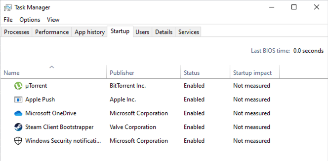

## 7.1 Student Guide: Introduction to Windows and `CMD`

### Class Overview

Today's class begins our unit on Windows administration and hardening. You will be introduced to to the Windows operating system and command line by performing basic system administration tasks in Windows 10.

### Class Objectives

By the end of class, you will be able to:

- Leverage the Windows command prompt (`CMD`) to execute various sysadmin responsibilities. 
- Use `wmic`, Task Manager, and `services.msc` to manage applications and services.  
- Create, manage, and view user information using the command-line tool `net`.
- Manage password policies using `gpedit`.

- Schedule tasks using Task Scheduler.

### Lab Environment

For today's demonstrations, we will be using the **Windows 10 virtual machine**, nested inside of a Windows DataCenter machine.

- Credentials for the Windows RDP machine:
  - Username: `azadmin`
  - Password: `p4ssw0rd*`

- Credentials for the Windows 10 VM for Day 1 Activities:
  - Username: `sysadmin`
  - Password: `cybersecurity`

Because we are using a virtualized environment for the Windows 10 machine, the screen resolution may not fill the entire screen during demos. 

To adjust screen resolution:

- Log into the Windows 10 VM and right-click anywhere on the screen.
- In the new tab that opened scroll down to **Display Settings**. 
- A new **Display** window will pop up. Navigate to **Display resolution** and adjust the resolution to match your screen from here.

#### Saved State Clearing

**NOTE:** Hyper-V VM's should be shut down after every session to avoid the HyperV Machine going into a hibernation known as a 'Saved State'. If a machine goes into a saved state, you may see the error `The application encountered an error while attempting to change the state of the 'VM-Name'.` 

If you see this error, the VM may not startup until you _delete the saved state_. Turning the VM's and the host machine off when not in-use will avoid this troubleshooting overhead.

To delete the saved state, run the following PowerShell line to clear the Hyper-V virtual machine _saved states_:

- `Get-VMSnapshot | Remove-VMSavedState`.

**NOTE:** If you are unsure how to launch PowerShell, click on to the bottom left `Start` menu button and type "PowerShell".

**NOTE** that if, at any point, you come across an error that says `The application encountered an eror while attempted to change the state of...` when starting up your virtual machines, you rill need to run `Get-VMSnapshot | Remove-VMSavedState` again.

After deleting the saved state, you can turn on the **Windows 10** and **Windows Server** virtual machines by running:

  - `Get-VM | Start-VM`
  
  
#### Differentiating between lab host machine and Windows 10 VM

Due to the lab machine and the Windows 10 virtual machine having the same background, it can make it confusing for students to know which machine they are working on. It is highly advised that you change the background for the lab machine (the one you RDP connect to) by doing the following:

- Right-click the Azure lab machine's desktop and select `Personalize`.

- On the `Personalize` page, you should change the background to something of your liking or a solid background color so that you know **NOT** to make any IP configuration changes to this machine

### Additional Resources

- [SS64 Windows Environment Variables](https://ss64.com/nt/syntax-variables.html)

- [SS64 Command-line info about WMIC](https://ss64.com/nt/wmic.html)

- [Microsoft Documentation on WMIC](https://docs.microsoft.com/en-us/windows/win32/wmisdk/wmic)

- [Net User Commands](https://www.digitalcitizen.life/how-generate-list-all-user-accounts-found-windows)

- [Adding Users from CMD](https://www.wikihow.com/Add-Users-from-CMD)

### Lesson Slideshow and Time Tracker

- The slides for today can be viewed on Google Drive here: [7.1 Slides](https://docs.google.com/presentation/d/1ERHhFFKFlgNLEBzvbRm_PTDLZJTMNKirIPPTsmhZ57E/edit)


- **Note**: Editing access is not available for this document. If you  wish to modify the slides, please create a copy by navigating to File > "Make a copy...".

---
### 01. Introduction to Windows

Today's lesson will introduce the fundamental concepts and details related to the Windows operating systems.

- Despite many IT professionals preferring Mac OS and Linux for their operating systems, Windows is still the market leader for desktop operating systems.

The ubiquity of Windows machines as personal computers makes them the most common target for today's attackers. 

- Much of the malware that exists today specifically targets vulnerabilities in unpatched and unsecured Windows personal computers and servers.

- Therefore, as a security professional, you will likely interact with Windows—whether it's the operating system you use daily, or as part of your company or client's infrastructure.

This knowledge is essential for the following technical roles, among others:

- **SOC Analyst**: As an SOC, or security operations center analyst, your familiarity with the Windows system will be tested nearly every day. You may see anywhere from tens to tens of thousands of alerts per day, specifically for Windows machines.

- **Systems Administration**: The large majority of system administrators work with one or more Microsoft environments: Windows PCs, Windows Servers, Office 365, and Exchange to name a few.

- **Penetration Testing**: Due to Windows being the PC most commonly used for organizations and businesses, it is vital that penetration testers know how to exploit Windows and Microsoft-specific platforms.

- **Endpoint Forensics**: Because the most commonly supported endpoint device in an organization is Windows, it is critical that forensics investigators understand how Windows works.

Today's exercises and demonstrations will use a single scenario involving a sysadmin using the command line (`CMD` in Windows) and GUI tools to troubleshoot a Windows PC, and develop a corresponding report for their CIO. 

You will complete the following tasks throughout the day:

- Audit processes with Task Manager.

- Use the command line to gather information and create files.

- Enforce password policies.

- Manage users.

- Automate tasks.


### 02. Introduction to Command Prompt (`CMD`) and Task Manager

Today's lesson focuses on navigating the file system with the Windows command line (CMD) and troubleshooting processes with Task Manager. 

In previous weeks, you learned to do exactly the same tasks on Linux. In particular, you learned how to:
- Create and change directories on the filesystem
- List and read files on the command line
- Enumerate and inspect running processes 

These and the other skills acquired in the Linux units are the "bread and butter" of systems administration — regardless as to the underlying operating system.

Today's lesson will focus on teaching you how to use Windows to perform these and other familiar tasks. In other words, you will be learning the "Windows way" of performing tasks you've already learned to do on Linux.

This give you a substantial learning advantage. What's new today is the operating system and the syntax — not the concepts.

As with Linux, before learning to navigate Windows, we must first study its general directory structure.

#### Directory and File Structure

Introduce the Windows file system structure by covering the following:

- Directories are indicated with a backslash (`\`), as opposed to Unix's forward slash (`/`).

- Discuss the following default Windows directory structure:

  ```console
  C:\
  ├── PerfLogs\
  ├── Program Files\
  ├── Program Files (x86)\
  ├── ProgramData\ [hidden folder]
  ├── Users\
  │     └── [username]\
  │           └── Desktop\
  │           └── Documents\
  └── Windows\
        └── System32\
              └── Config\
              └── Drivers\
                      └── etc\
                            └──hosts
                            └──networks
        └── Spool
        └── Temp
  ```

- Windows directory structure does not follow the conventional naming scheme or structure of common Unix systems. For example, instead of directories named `/etc` and `/var`, there are directory names such as `Program Files` and `PerfLogs`.

#### Common Directories 

Now let's look at some common and important Windows directories and compare them to Linux counterparts, where applicable. In these examples, our root drive is `C:\`:

- `C:\` (or whichever root drive Windows is installed on) is the root drive.

- `C:\Program Files\` is where 64-bit applications are installed.

- `C:\Program Files (x86)\` is where 32-bit applications are installed.

- `C:\ProgramData\`  is a hidden directory where application-specific settings reside.

- `C:\Users\` is the directory for all users, including the `Default` user. This is similar to Linux's `/home` directory.

- `C:\Users\[username]\` is each specific user's home folder. Their settings and files are saved here and in subdirectories.

  - `C:\Users\[username]\Documents\` is the `Documents` folder for the current user.
  - `C:\Users\[username]\Desktop\` is the `Desktop` folder for the current user.

- `C:\Windows\` is where Windows-specific programs and libraries are located.

  - `C\Windows\System32\` is where **64-bit** main component Windows system applications configuration settings are located.

Familiarity with these directories will develop over time, as we complete activities and learn more about Windows environments. 

#### The First Windows Shell: Command Prompt `CMD`

The Windows command prompt `CMD`, or `cmd.exe`, is the command line interface for Windows, comparable to a Unix shell, such as **bash** for Linux.

Let's get started by introducing some basic commands. 

- Note: Some commands are similar to Linux, while some are completely different.

Navigation commands:

  - `cd` or `chdir` changes directories. This works like Linux's `cd`.

  - `dir` lists the contents of a directory. This works like Linux's `ls`.

Command prompt operations:

  - `md` or `mkdir` creates directories.

  - `copy` copies a file. This works like Linux's `cp`.

  - `move`  cuts and pastes files. This works like Linux's `mv`.

  - `del` or `erase` deletes files and directories. Directories will prompt a user to confirm.

    - Note that files deleted with this command do not go to the `Recycle Bin`, as they do when we delete files with a GUI. Deleted files cannot be restored. 

  - `rd` or `rmdir` removes a directory if it's empty. Non-empty directories must be removed with `rmdir /S` or `rd /S`.

  - `find` works like `grep` in that it searches a file for specific criteria. For example, `find "hello" greeting.txt` will search the `greeting.txt` file for the string `hello`.

  - `exit` will close `CMD`.
  
  - `type` followed by a filename will show the contents of a file. This is similar to `cat` in Linux.
  
  - `| more`, pronouced _pipe more_ shows contents of the command line in a per-screen format.
  
    - We will need to use this _pipe more_ command in order to display our command outputs properly.

Next, note the following intricacies and best practices for command prompt syntax:

- Command prompts are not case sensitive with directories and files. 

  - For example, if, while in the `C:\` directory, you run `cd "program files"` (all lower case), it will have the same effect as running `cd "PROGRAM FILES"` (all upper case).

- When writing a directory name or filename that contains spaces, enclose the filename in double quotes `""`, as seen in the previous example: `cd "program_files"`.

#### Command Prompt `CMD`: Environment (ENV) Variables

Remember **environment variables** from the bash programming unit? In Windows, they work the same way in Windows.

- Environment variables, also called envvars, are special values that contain information about the system, such as the user's home directory, or the system's program files directory.

Envvars in Windows can be used for the following:

- Replacing long directory paths with shorter ones.
- Grabbing the current time
- Finding the location of your system files.

-  **Environment (ENV) variables** are usually pre-set by the system and can be used in the command line or scripts.

-  `CMD` **environment variables** are different than Linux's in that they are surrounded by percent signs (`%`) instead of starting with a `$` sign.

  - For example: 
    - Windows: `%VAR%` 
    - Linux: `$VAR`  

  - If we want to navigate to the 64-bit `Program Files` folder, we  type `cd %ProgramFiles%` in the console. The `%ProgramFiles%` **environment variable** represents the _entire directory path_ of `C:\Program Files`.

We can also combine **environment variables** with regular directory names.

- With the command prompt open, enter `cd %USERPROFILE%\Desktop` and hit enter to navigate to the current user's desktop.

-  `%USERPROFILE%` is an **environment variable** that represents the directory `C:\User\[current user]`. When executed with a console command such as `cd`, it will behave like a variable. This is the same as `$HOME` in Linux.

#### Common ENV Variables

Like Linux, many default environment variables exist for Windows.

| Environment Variable | Default Value          |
| -------------------- | ---------------------- |
| `%CD%`                 | Current directory      |
| `%DATE%`               | Current date       |
| `%OS%`                 | Windows                |
|` %ProgramFiles%`     | C:\Program FIles       |
| `%ProgramFiles(x86)%`  | C:\Program Files (x86) |
| `%TIME`                | Current time       |
| `%USERPROFILE%`        | C:\Users\{username}    |
|` %SYSTEMDRIVE%`        | C:\                    |
| `%SYSTEMROOT%`         | C:\Windows             |


Note: You won't need to know all of these and can use this list as a reference. 

#### Command Prompt `CMD`: Navigation and Output Walkthrough

As you become more proficient with the command line, you will be more prepared to execute and automate tasks in future systems and security-related roles.

In the following demonstration we will create and manage files with the command prompt in Windows. More specifically, we will:

* Navigate to the current user `sysadmin`'s Desktop directory by using the change directory or `cd` command with the environment variable `%USERPROFILE%`.

Let's get started:

Boot up and log into the `Windows 10` machine located in Hyper-v:

- Use the credentials:
  - Username: `sysadmin`
  - Password: `cybersecurity`

Click on the "Type here to search" bar located in the bottom left of the screen and type: `CMD` to open the command prompt app. 

`%USERPROFILE%` is a variable that is assigned to the value of the **current user's home directory**, or in this case: `C:\Users\sysadmin`.

- Run `cd %USERPROFILE%\Desktop`. The prompt should now look like:

  ```console
  C:\Users\sysadmin\Desktop
  ```

 `echo %CD%` will print the _current directory_ path. Note: this variable is different from the Linux command `cd`.

- Run `echo %CD%` and note the output:

  ```console
  C:\Users\sysadmin\Desktop>echo %CD%
  C:\Users\sysadmin\Desktop
  ```

The command `dir`, or _directory_, will display the current directory's contents.

- Run `dir` to show the contents of the directory.

Piping output from the command line in Windows works the same way as Linux: it uses the single (`>`) and double (`>>`) greater-than symbols for **outputting** and **appending**.

We'll now use the `>` operator to send output to a file:

- Run `echo DELETE > delete_me.txt`

- Enter `type delete_me.txt` to show the contents of the file:

  ```console
  DELETE
  ```

Just like in Linux, we can use the double greater-than symbol (`>>`) to _append_ your command prompt's output to a file.

- Run `echo ME >> delete_me.txt`

- Enter `type delete_me.txt` to show the contents of the file:

  ```console
  DELETE
  ME
  ```

Now delete the demo file.

- Run `del delete_me.txt` to delete the file.

#### Starting the Report Demonstration

Today's activities and demonstrations will involve a junior Windows system administrator for the data analytics company Good Corp Inc. We will be using the Windows `CMD` to output various details of a Windows workstation into a reports file. 

More specifically, we'll be using the following scenario: 

- Good Corp's  previous senior developer, `sysadmin`, was using this Windows system for a company project. They were the only developer on the project. 

- Because Good Corp only uses Linux and Mac, there are no existing policies or previous setups for managing a Windows environment. 

- You are assisting the CIO in developing a standardized Windows workstation in order to get the next developer set up as quickly as possible and ensure that all future Windows workstations use a standardized Windows-specific development environment. You will create and eventually generate automated reports that describe specifics of this workstation.

To get started, we will need to create a `reports` folder in the user's `Desktop` directory: 

- While still in the `Desktop` directory, run `mkdir reports`.

- Enter `dir` to verify that the `reports` folder was created and then navigate to it with `cd reports`.

The CIO will be checking this folder regularly for your `reports` file on this Windows workstation.

- Run `echo Baselining Report > report.txt`

- Verify that you created a text file called `report.txt` by typing `dir` and checking the directory contents.

- Append a subtitle that says `Created by [your name here]` to the report using `>>`.  
  
    - `echo Created by [your name here] >> report.txt`

- Verify your commands worked by entering `type report.txt`.


#### Introduction to Task Manager

One of the most important Windows tools for troubleshooting resource utilization is Task Manager. It is similar to the `top` command in Linux for auditing tasks and processes.

Tasks in Windows are much like the processes and PIDs that we worked with in the Linux units.

It is important to be able to audit and manage tasks and processes in order to identify incorrect or malicious tasks.  

- For example, many cryptojacking processes, or cryptominers, use excess CPU and network resources even while the system is idle.

- Also, some programs, when not in use but left open, use unnecessary resources or even cause memory leaks that eventually cause system crashes. In Windows, crashes are known as the **blue screen of death**.

We will now walkthrough how to audit tasks based on resource utilization.

There are multiple ways to open Task Manager: 

1. Press `CTRL+ALT+DEL`, and select Task Manager from the screen prompt.
    - **Note:** If you are using a Mac, you will need to click on the "Action" tab in the Hyper-V windows, then click `Ctrl+Alt+Delete`. 

2. Press the `Start` menu icon, the `Search` icon, or the `Windows` key, type _Task Manager_ and hit enter.
    - **Note:** You will be unable to perform this on a Mac. 

3. Use the search bar in the bottom left-hand corner to search for _Task Manager._ 

Launch Task Manager, and go to the `Processes` tab. 

* All running processes on the computer can be seen in this tab. 

- We can sort processes in descending or ascending order, and by their resource utilization, by using the column headers: `CPU`, `Memory`, `Disk`, `Network`, and `GPU`.

With Task Manager still open, go to the `Performance` tab.

* In this tab, we can see computer resource utilization visualized in charts.

- This shows processor utilization by individual hardware and logical cores.

Other tabs of Task Manager can be used to manage things such as services, startup applications, and users, but those will either be covered later or are better managed by other tools, such as `services.msc` for services.

#### Managing Task Manager

One of the key functionalities of Task Manager is ending errant processes—processes that are not behaving as they should. 

* For example, suppose that we notice spikes in CPU usage.  We would need to identify the errant process creating these spikes, and end it.

Let's walk through how to end errant processes using Task Manager.

With Task Manager and the `Processes` tab still open:

  - Click on the `CPU` column header to sort the CPU by descending resource utilization.

  - We're going to end the Microsoft Edge task.
  - Click on the Microsoft Edge task within Task Manager, so the process is highlighted. Since we are sorting by CPU utilization, the process will shift around, since it is using CPU to constantly check other processes and tasks.

Tasks can also be ended by right-clicking the task and selecting `End task`.
- With  Microsoft Edge still highlighted, select `End task`. 

This is a very fundamental way of auditing processes by their resource utilization.


### 03. Task Manager and `CMD` Activity 

- [Activity File: Task Manager and CMD ](Activities/03_Intro_CMD/Unsolved/readme.md)

### 04. Task Manager and CMD Review 

- [Solution Guide: Task Manager and CMD](Activities/03_Intro_CMD/Solved/readme.md)

### 05. Creating a Report with `wmic` Output 

Now we will be further developing the Windows command line proficiency with the command-line tool `wmic`: **Windows Management Instrumentation Command**.

- `wmic`, a very powerful tool for managing Windows computers, allows a user to query a large array of system information and diagnostics, such as information about the operating system and hard disks.

- System administrators can also use `wmic` to launch, terminate, install, and uninstall processes.

We will be using this command-line tool extensively to retrieve information about the system to add to our Windows report.

#### `wmic` Structure and Conventions

`wmic` has the following query structure:

`wmic [global switches] [alias] [verbs] [properties]`

- `[global switches]` are global commands called on `wmic`. They can do things like specify a file to append output to. Today, we will use the command `/APPEND`.

  - For example: `wmic /APPEND:report.txt os get caption` will append the Windows build number to `report.txt` file. This will add the output content to the file, and **not** overwrite the file. 
- `[alias]` is the Windows component that you want `wmic` to query. Common aliases include:
  - `os` (_operating system_), containing properties specific to the operating system, such as the Windows edition name and build number.
  - `logicaldisk`, containing properties specific to the disk drives, such as drive name, file system, free space, size, and volume serial number.
- `[verbs]` are actions we want to complete with the `wmic` command. 
  - For example, if we are using `wmic os` to find operating system information, we will then use the `get` verb, followed by the various `[properties]` we want to find.
- Common `[properties]` retrieved using `get` include:
  - `caption` (i.e., `get caption`): returns a one-line description of the given `alias`.
  - `/value` (i.e., `get /value`): returns _all_ of the properties and values of an alias and lists each on separate line. 

#### Applying `wmic`

Now that we've covered the parts of a `wmic` query, let's retrieve information about the current operating system, which we will later add to our report.

First we're going to use the `get /value` verb on the `os` alias:

- Run `wmic os get /value` to return:

  ```console
  BootDevice=\Device\HarddiskVolume6
  BuildNumber=18362
  BuildType=Multiprocessor Free
  Caption=Microsoft Windows 10 Enterprise Evaluation
  ... [results truncated]
  ```

Now, we want to retrieve brief information about the operating system (or `caption`) and its build number. We will call those properties with `get`:

- Run `wmic os get caption, buildnumber` to return:

  ```console
  BuildNumber  Caption
  18362        Microsoft Windows 10 Enterprise Evaluation
  ```

- The output shows that we retrieved the `caption` and `buildnumber` properties of the operating system alias using the verb `get`.

Once we've verified the results are what we want, we can append them to a file:

- Run `wmic /APPEND:report.txt os get caption, buildnumber`

Verify the output using the `type` command:

- Run `type report.txt` to return:

  ```console
  BuildNumber  Caption
  18362        Microsoft Windows 10 Enterprise Evaluation
  ```

- If the file's contents do not match what we want, we can simply use `del` to delete the file and start again.

Now we're going to look for the following properties for each disk drive on the system with the the `logicaldisk` alias:

- Each disk drive's name (or `caption`)
- The installed file system
- The amount of free space capacity
- The total drive capacity
- The volume serial number

Run `wmic logicaldisk get caption, filesystem, freespace, size, volumeserialnumber`

- The output is:

  ```console
  Caption  FileSystem  FreeSpace      Size           VolumeSerialNumber
  C:       NTFS        36213682176    499460861952   920D80EE
  ```

After we verify that the output looks good, we can add the `/APPEND` global switch:

- Run `wmic /APPEND:report.txt logicaldisk get caption, filesystem, freespace, size, volumeserialnumber`

- Run `type report.txt`

Now we have both of the previous outputs in our report:

```console
  Baselining Report
  Created by [your name here]
  Windows_NT system report created on Tue 11/19/2019 with logged in user, sysadmin
  BuildNumber  Caption
  18362        Microsoft Windows 10 Enterprise Evaluation

  Caption  FileSystem  FreeSpace      Size           VolumeSerialNumber
  C:       NTFS        36179750912    499460861952   920D80EE
```

Knowing how to use `wmic` is a vital first step to learning Windows system administration. While these are simple queries, `wmic` has many more powerful features that can manage and retrieve information on local and remote Windows personal computers and servers.

### `wmic` Demo

In the following walkthrough, we will move through different programs, note their importance in a sysadmin context, and `get` and append them to our report. 

#### User Information

The `useraccount` `wmic` alias allows you to retrieve information about user accounts. 

- System administrators often need to manage new users within an organization, as employees, clients, and vendors, are constantly created, updated, and deleted.

In this walkthrough, we'll retrieve the following properties from the `useraccount` alias:

- **Name/Caption** (or `caption`): The name of each user account.

- **Security ID** (or `sid`): The security ID of each user account. These are used to identify the groups the user belongs in, to set access control entries, and to bind security descriptors to each user.

- **Description** (or `description`): This property retrieves information about the user account if it exists.

We will `get` these properties and append them to our report.

- Run `wmic /APPEND:report.txt useraccount get caption, sid, description` and show the output:

    ```
    Caption                           Description                                               SID                                                                                 
    DESKTOP-OCCSCFV\ADMINISTRATOR     Built-in account for administering the computer/domain   S-1-5-21-1450304738-2633819567-3804770193-500
    DESKTOP-OCCSCFV\Alex                                                                          S-1-5-21-1450304738-2633819567-3804770193-1004                                                                                                              
    DESKTOP-OCCSCFV\DefaultAccount     A user account managed by the system.                  S-1-5-21-1450304738-2633819567-3804770193-503                                                                                                                 
    DESKTOP-OCCSCFV\Guest              Built-in account for guest access to the computer/domain.  S-1-5-21-1450304738-2633819567-3804770193-501                                     
    DESKTOP-OCCSCFV\sysadmin           Built-in account for administering the computer/domain.              S-1-5-21-1450304738-2633819567-3804770193-1003                                                                                               
    DESKTOP-OCCSCFV\WDAGUtilityAccount A user account managed and used by the system for Windows Defender Application Guard scenarios.  S-1-5-21-1450304738-2633819567-3804770193-504                                                           
    ```


- Run `type report.txt`.

#### Startup Processes

The `netlogin` `wmic` alias allows you to retrieve user logon metrics. 

- User logins on an office-only machine after a certain date or at odd times (such as non-business hours) may indicate that the workstation is compromised.  

In the next walkthrough, we will retrieve this information from the `netlogin` alias:

- **Name/Caption** (or `caption`): Name of the current user, `sysadmin`.

- **Number of logons** (or `numberoflogons`): Number of logons for the current user, `sysadmin`. While number of logins doesn't necessarily indicate a security issue, an abnormally high amount of logins may be a sign of suspicious activity.

- **Last logon time** (or `lastlogon`): Time of last logon for the current user, `sysadmin`. Any logins past a certain point, such as the employee's last confirmed day at the company, may indicate that the account is compromised.

We'll `get` these properties and append them to our report.

- Run `wmic /APPEND:report.txt netlogin get caption, numberoflogons,  lastlogon`:

  ```console
  Caption              LastLogon                  NumberOfLogons
  NT AUTHORITY\SYSTEM
  sysadmin              20191029115422.000000-300  47
  ```
  - **Note:** Results may vary. 

Output breakdown:

- The `LastLogon` format follows the `yyyy/MM/DD-HH:mm:ss.SSSSSSZ` date and time format. 

- `.SSSSSSZ` are the milliseconds (`000000` in the output) and timezone (`-300` in the output). 
  
  - This part of the output follows the `SimpleDateFormat` protocol for denoting date and time.

Run `type report.txt` to display the new report.

#### Startup Applications

The `startup` `wmic` alias allows you to retrieve information about startup applications on the system. System administrators need to understand and manage the applications that startup with a Windows workstation. Changes to these may indicate a malware installation or installation of unwanted applications by users.

We are going to be retrieving the following properties from the `startup` alias:

- **Name/Caption** (or `caption`): the name of each startup application.
- **Command** (or `command`): the execution path of this startup process.

- **User** (or `user`): the user that the startup application runs as on boot.

We'll `get` these properties and append them to our report.

- Run `wmic /APPEND:report.txt startup get caption, command, user` and show the output:

  ```
  OneDriveSetup      C:\Users\SysWOW64\OneDrive.exe" /thfirstsetup                           NT AUTHORITY\LOCAL SERVICE
  OneDriveSetup      C:\Program Files (x86)\Steam\steam.exe" -silent                         NT AUTHORITY\NETWORK SERVICE
  crypto_miner.vbs   crypto_miner.vbs                                                        DESKTOP-OCCSCFV\sysadmin
  Skype              Skype.lnk
  OneDrive           "C:\Users\sysadmin\AppData\Local\Microsoft\OneDrive\OneDrive.exe" /background  DESKTOP-OCCSCFV\sysadmin
  Skype for Desktop  C:\Program Files (x86)\Microsoft\Skype for Desktop\Skype.exe            DESKTOP-OCCSCFV\sysadmin  SecurityHealth     %windir%\system32\SecurityHealthSystray.exe                                   Public
  ```
  - **Note:** Results may vary. 


Output breakdown: 

- The `Caption` section indicates the name that the startup application is commonly known as. 
- The `Command` section indicates where it actually launches from.
- The `User` column indicates what user the application starts under. 
- **Note**: the `%windir%` environment variable in this output is the same as `C:\Windows`.

Run `type report.txt`.

#### Startup Services

The `startup` `wmic` alias allows you to retrieve information about startup services on the system. 

- As with startup applications, system administrators need to have a thorough understanding of what common and acceptable services are running on a system. 

- Services are a common way to obfuscate rogue processes.

#### `wmic` `where` Clause

We will be adding the `where` clause to our `wmic` query for the following activity. 

- The `where` clause allows you to narrow down results that match the given property. 

- In this case, we only want services that are set to automatically run on startup. When combined with the `service` alias, this has the syntax: `wmic service where (startmode="auto")`.

We are going to be retrieving the following properties from the `startup` alias:

- **Name/Caption** (or `caption`): name of each user account.

- **State** (or `state`): current execution state of this startup service.

We will `get` these properties and append them to our report:

- Run `wmic /APPEND:report.txt service where (startmode="auto") get caption, state` and show output:

  ```console
  Name                    State
  AudioEndpointBuilder    Running
  Audiosrv                Running
  BFE                     Running
  BITS                    Running
  BrokerInfrastructure    Running
  CDPSvc                  Running
  CoreMessagingRegistrar  Running
  CryptSvc                Running
  ...[results truncated]
  ```


Run `type report.txt`.


### 06. Creating a Report with `wmic` Output Activity

- [Activity File: Creating s Report with `wmic` Output](Activities/06_WMIC_OS/Unsolved/readme.md)


### 07. Creating a Report with `wmic` Output Review

- [Solution Guide: Creating a Report with `wmic` Output](Activities/06_WMIC_OS/Solved/readme.md)

### 08. Remove Unwanted Programs and Services 

Remember all the applications that opened when we first logged in? In this section, we are going to prevent that from happening. 

We will continue our system administration tasks by using the GUI and command line to complete the following: 

- Disable startup applications.

- Disable startup services.

- Uninstall programs (with GUI).

- Uninstall programs (with `wmic`).

#### Disabling Startup Applications (Task Manager)

Managing startup applications is important for system and security administrators for multiple reasons:

- Startup applications can slow boot time due to their execution priority.

- These applications may use excessive resources while in the background, causing random system slowdowns.

- Applications might use the network in the background. They might, for example, initiate their own automatic updates, hogging network bandwidth.

- Startup applications may require special permissions for their functionality. These can pose security risks if, for example, they are compromised through malware. Malware could then potentially run with escalated privileges.

We will be looking at using the GUI tool, Task Manager, to manage and audit these startup applications.

Our CIO has read the latest report we prepared and noticed that the peer-to-peer file sharing application, uTorrent, was installed. Your CIO has asked that you disable it from starting up automatically as it poses a security risk by exposing your public IP address to others.

Your CIO does not want the application uninstalled, so that it may be audited.

- Launch Task Manager with `CTRL+ALT+DEL`.

- Navigate to the `Startup` tab.

  - This tab shows a list of processes that start up with Windows.

- Notice the he uTorrent startup process:

   

- Highlight the application.

- Right-click to disable it.

We have now disabled this application from starting up automatically with Windows.

#### Disabling Startup Services (`services.msc`)

Now we will look at disabling services:

- Windows services are most similar to Linux daemons in that they are usually GUI-less processes that run on startup and in the background. 

- Because Windows services also often run with elevated privileges, they can pose even greater risks as they can be harder to troubleshoot without Windows system administration experience.

Continuing with our reporting scenario, the CIO was concerned about a service they saw was starting with Windows. This service is the telemetry-based service Downloaded Maps Manager, automatically installed with Windows 10, which downloads offline maps when map applications are in use. Disabling this service is our first step in disabling all telemetry and data gathering applications on this Windows 10 computer.

- Launch `services.msc` by typing it's name into the bottom left search bar.

- With `services.msc` open, scroll down until you find the `Downloaded Maps Manager` service.

- Right-click and select `Properties` in the dropdown list. Select `Disable`, then `Apply` and `OK`.

When this machine boots to again, the disabled service won't start with Windows.

#### Uninstall Program (GUI)

Now the CIO wants you to entirely remove any and all components of Adobe Flash Player on the system. 

Adobe Flash Player is well-known among the cybersecurity community for being one of the most vulnerable browser plugins. Because of the many security issues Flash Player has had in the past, many browsers have officially disabled Flash as a default.

- [Adobe Flash Player Vulnerabilities](https://www.cvedetails.com/vulnerability-list/vendor_id-53/product_id-6761/Adobe-Flash-Player.html)

  - If you are curious, you can use the link and look up Flash Player. If they sort by _CVSS Score Descending_, the results will include 14 pages of Flash Player vulnerabilities with the highest vulnerability score. In total, more than 1,000 Flash Player vulnerabilities have been officially recognized. Clearly, there is good reason to quickly remove Adobe Flash Player from this Windows workstation.

- Navigate to the `Start` menu and click on the cogwheel button.

- In the `Windows Settings` window, click on the `Apps` button and take note of the center list. This is where Windows' installed apps can be modified or uninstalled.

- Scroll through the list until you find Adobe Flash Player 32 NPAPI. NPAPI is Firefox's Flash Player plugin.

- Click `Uninstall` on the prompt.

#### Uninstall Programs (`CMD`/`wmic`)

Now that we have removed Flash Player from our system, the next task from our CIO is to find all traces of QuickTime Player and its associated Apple applications, and uninstall them.

- QuickTime Player is known to be a vulnerable program as well, though does not have as bad a reputation as Flash Player.

For this task, we will be using the command line with `wmic` again, in conjunction with the `WHERE` clause and a `call` method.

The `call` method can be added to the end of a `wmic` query to execute a command.

- Programs installed with the Windows installer can be found with the `wmic` command using `wmic product get name,version`.

  - Launch `CMD` with `Run as administrator`, and enter `wmic product get name,version`.

  - Note the list of programs `wmic product` returns.

- Execute `wmic product where (name="QuickTime") call uninstall` to uninstall QuickTime.

- We will also be uninstalling the Apple Software Update. Don't forget to wrap the names in double quotes.

  - Run `wmic product where name="Apple Software Update" call uninstall`

  - `ReturnValue=0` means the program was uninstalled successfully.


### 09. Remove Unwanted Programs and Services Activity

- [Activity File: Removing Unwanted Programs and Services](Activities/09_Remove_Unwanted/Unsolved/readme.md)

### 10. Removing Unwanted Programs and Services Review

- [Solution Guide: Removing Unwanted Programs and Services](Activities/09_Remove_Unwanted/Solved/readme.md)

### 11. Instructor Do: Users, and Password Policies 

Now, we will use the command line to find user password and logon information.

Important: Before working on activities involving reports, change to sysadmin's `Desktop/reports` folder.

#### Introducing `net`

Now, we will be using the command-line utility known as `net`.

- `net` allows an administrator to query and set various settings relating to user accounts, groups, and password policies. 

- For example, a system administrator might pull information about an employee who has left the company to see when they last logged in. They can then use `net` to delete their account.

We will be using the following `net` utilities:

- `net user`: Used for adding, removing, and managing users. In the following activity, we will use it to enumerate a list of all the users on the system to add to our report, and then to enumerate information about the previous Windows developer, `sysadmin`.

- `net localgroup`: Used for adding, removing, and managing local groups.

    - While we are working with local groups now, we will be looking at domain groups in the future. Domain groups are groups created in Windows Server to manage entire sets of users with identical user permissions and policies.

- `net accounts`: Allows you to see password and logon requirements for users to enforce password security policy.

  - `net accounts` can be used to set the following password policies:

    - The time before a password expires.

    - The minimum number of characters required for password.

    - The amount of time before passwords expire.

    - The minimum number of days before a password can be changed.

    - Number of times a password must be unique before it can be reused again. In other words, if this is set to two, a user needs to change their password to two new ones before an old one can be used again.

For now, we will only be retrieving these settings for our report to the CIO, but we will manage these in the following activity.

Managing these passwords is similar to editing `/etc/pam.d/common-password` settings in Ubuntu Linux.

#### `net` Demonstration Setup

Next, we'll demonstrate `net` using the following scenario: 

- Your CIO was curious about the groups and password policies on the Windows workstation. You are to retrieve more information from this Windows workstation using the `net user` command-line utility.

We will be using the `net` tool to find information about user groups and password policies by doing the following tasks:

  - Enumerate users to see `net` output.

  - Enumerate `sysadmin`'s groups and password policies.

  - Enumerate local groups with `net localgroup` and append the output to their report.

  - Enumerate the Windows workstation's current password policies with `net accounts`.


#### Enumerate Users with `net`

First, we will use the `net user` account to enumerate all the users on the system.

- Run `net user`:

  ```console
  -------------------------------------------------------------------------------
  Administrator                        Alex                     DefaultAccount                     
  Guest                             sysadmin                 WDAGUtilityAccount
  The command completed successfully.
  ```

- Run `net user >> report.txt`

#### Find **`sysadmin`**'s Password Status

Next, we will look at specific password settings for our user `sysadmin`.

- Run `net user sysadmin` and notice the following in the output:

  - `Password last set`: When the password was last set for user, `sysadmin`. It was last set on ‎01/28/‎2020 at 2:25:37 PM.

  - `Password expires`: The date that the current password for user, `sysadmin`, will expire. In this case, 01/‎30/‎2021 2:25:37 PM.

  - `Password changeable`: The earliest date that the user `sysadmin` can change their password again. In this case, 01/‎28/‎2020 2:25:37 PM.

  - `Password required`: The password policy that specifies whether or not the user _needs_ a password. For this user, they must have a password.

  ```console
  User name                    sysadmin
  Full Name
  Comment
  User's comment
  Country/region code          000 (System Default)
  Account active               Yes
  Account expires              Never

  Password last set            ‎01/28/‎2020 2:25:37 PM
  Password expires             01/‎30/‎2021 2:25:37 PM
  Password changeable          01/‎28/‎2020 2:25:37 PM
  Password required            Yes
  User may change password     Yes
  ```
  - **Note** Your output will look slightly different based on when your class started. 

We will be changing these password policies later.

- Run `net user sysadmin >> report.txt` to append this output to the report.

#### Find Groups on the Machine

Now we will enumerate a list of groups on the Windows workstation to add to our report. It's important to know how to enumerate groups on a system as groups are created, removed, and updated as often as users are. 

Groups of users can include: administrators, non-privileged users, users sorted by departments, users from third-party contractors, etc.

- Run `net localgroup` and note the output:

  ```console
  Aliases for \\DESKTOP-OCCSCFV

  -------------------------------------------------------------------------------
  *Access Control Assistance Operators
  *Administrators
  *Backup Operators
  *Cryptographic Operators
  *Device Owners
  *Distributed COM Users
  *Event Log Readers
  *Guests
  *Hyper-V Administrators
  *IIS_IUSRS
  *Network Configuration Operators
  *Performance Log Users
  *Performance Monitor Users
  *Power Users
  *Remote Desktop Users
  *Remote Management Users
  *Replicator
  *System Managed Accounts Group
  *Users
  The command completed successfully.

  ```
  - **Note:** Results may vary. 

- Run `net localgroup >> report.txt`.

#### Current Password Policy

Next, we'll pull the password policies that are currently set for the Windows workstation:

- Run `net accounts` and note the output:

  ```console
  Force user logoff how long after time expires?:       Never
  Minimum password age (days):                          0
  Maximum password age (days):                          90
  Minimum password length:                              0
  Length of password history maintained:                None
  Lockout threshold:                                    Never
  Lockout duration (minutes):                           30
  Lockout observation window (minutes):                 30
  Computer role:                                        WORKSTATION
  The command completed successfully.
  ```
  - **Note:** Results may vary. 

- Run `net accounts >> report.txt` to append this output to the report.

- Run `type report.txt` to display the latest output.

Enumerating information about users, groups, and password policies is important. For one, this information helps our CIO understand a baseline specific to this Windows workstation. It is also important in the real world, as system administrators need to reliably pull this type of information from workstations to ensure they adhere to company policies.

### 12. Users, Groups and Password Policies

- [Activity File: Users, Groups, and Password Policies](Activities/12_Users/Unsolved/readme.md)

### 13. Users, Groups and Password Policies 


- [Solution Guide: Users, Groups, and Password Policies](Activities/12_Users/Solved/readme.md)


### 14. Instructor Do: Creating Users and Setting Password Policy (0:10)

In this section, we will be covering another common sysadmin responsibility: setting user password policies. 

We covered the importance of password policies in the previous Linux units. Now we'll demonstrate applying similar concepts.

- Your CIO noticed there wasn't a solid local password policy for the existing administrator. 

- You now must create an administrator and regular user on the Windows workstation. 

- Then, you will  set a password policy to ensure these users' passwords adhere to company-wide password policies.

We'll use the `net user` utility to create Windows user accounts for the next two new users: senior developer `Andrew`, and sales representative `Bob`.

For the next activity we are going to learn to do the following:

- Create a regular user, `Bob`.

- Create an administrator user, `Andrew`.

- Change user groups with `net localgroup`.

- Set workstation password policies with `gpedit`.

#### Creating a Regular User

In the previous activity, we used the command `net user` to show a list of all users on the system and then appended the results to our report.

Now we will use the `net user` utility again, adding a username after `net user`, and forward-slash-add (`/add`), so that our new command looks like: `net user [username] /add`.

- We can also specify a password for the user by typing a password after the username, with the following syntax: `net user [username] [password] /add`.

To combine those steps and add a user named `Bob` with the password `cybersecurity`, we use `net user Bob cybersecurity /add`.

- Run `net user Bob cybersecurity /add`. If successful, we'll get the following output:

  ```console
  The command completed successfully.
  ```
  Now a regular user, `Bob`, exists.

#### Creating an Administrative User with Elevated Privileges

Now we'll be creating a new user account for the new Windows senior developer, `Andrew`, and adding it to the `Administrators` group.

Start by running the same command for creating a new user. You will use the name `Andrew` instead of `Bob`:

- Run `net user Andrew cybersecurity /add` and note the output:

  ```console
  The password entered is longer than 14 characters.  Computers
  with Windows prior to Windows 2000 will not be able to use
  this account. Do you want to continue this operation? (Y/N) [Y]: y
  The command completed successfully.
  ```

- Note that Windows versions prior to `Windows 2000` could not support passwords longer than 14 characters. Press `Y`.

After creating the user, `Andrew`, we can use the `net localgroup` command-line utility to add `Andrew` to the `Administrators` local group. This will allow Andrew to manage the Windows workstation as a super user.

Add Andrew to the `administrators` group:

- Run `net localgroup Aministrators Andrew /add` and then note the output:

  ```console
  The command completed successfully.
  ```

We can use the `net user` command, as in the previous activity, to check the user's account parameters:

- Run `net user Andrew`. Note the `*Administrators` group at bottom of the output:

  ```console
  ...[results truncated]
  Local Group Memberships      *Administrators       *Users
  Global Group memberships     *None
  The command completed successfully.
  ```

We've now successfully created a new user and added them to the `Administrators` localgroup.

#### Setting the Windows Workstation's Password Policy

Now that we have our users, we want to define and enforce a strong password policy for this Windows computer.

We will be using the GUI tool `gpedit` to set password policies with the following parameters:

- Maximum password age to 90 days.

- Minimum password length to 12 characters.

- Password complexity requirements to be enabled.

Run `gpedit` and navigate to `Windows Settings` > `Security Settings` > `Account Policies` > `Password Policy`, and set the following:

- Set `Maximum password age` to `90` days. While `Maximum password age` is highlighted, right-click it, and click on `Properties` to see the tabs for enabling and disabling the option. You can also go to the `Explain` tab to see what best practices exist for password expiration policies.

  

- Set `Minimum password length` to `12 characters`

- And lastly, double-click on `Password must meet complexity requirements`, and set to `Enabled`. Select `Apply`, then click on the `Explain` tab and read the following:

  ```console
  Password must meet complexity requirements

  This security setting determines whether passwords must meet complexity requirements.

  If this policy is enabled, passwords must meet the following minimum requirements:

  Not contain the user's account name or parts of the user's full name that exceed two consecutive characters
  Be at least six characters in length
  Contain characters from three of the following four categories:
  English uppercase characters (A through Z)
  English lowercase characters (a through z)
  Base 10 digits (0 through 9)
  Non-alphabetic characters (for example, !, $, #, %)
  Complexity requirements are enforced when passwords are changed or created.
  ```

### 15.  Create User and Set Password Policy Activity (0:10)

- [Activity File: Creating Users and Setting Password Policies](Activities/15_Create_User_Password_Policy/Unsolved/readme.md)

### 16.  Creating Users and Setting Password Policy Review (0:05)

- [Solution Guide: Creating Users and Setting Password Policies](Activities/15_Create_User_Password_Policy/Solved/readme.md)


### 17. Task Scheduling 

In the final section of this lesson, we will use the administrative user, `Andrew`, to create scheduled tasks that will automate the reports we've been working on. 

Task Scheduler is a GUI tool that allows system administrators to automate the execution of scripts and applications on a Windows system. 

- These are similar to cron jobs in Linux in that they can be set to execute at specific times or after a certain amount of time once a user logs in. 

- It is  important to properly manage systems with scheduled tasks to automate security and system administration actions such as: checking for updates for endpoint security software, sending important logs to systems such as SIEMs (Security Information and Event Management), or scheduling system maintenance scripts.

#### Task Scheduling Demo

- Your CIO wants to schedule reports to be created on a daily basis.  This system isn't remotely managed at the moment, and with a new developer coming in, huge changes might be made to the machine's configuration. 

- This will help reduce workstation development drift for any new users for the Windows environment, and for this specific developer position and project.

- Your CIO has asked you to use the GUI tool Task Scheduler to create a task that will run each day.


[Activity File: Task Scheduling ](Activities/18_Scheduling_Tasks/Unsolved/readme.md)

[Solution Guide: Task Scheduling](Activities/18_Scheduling_Tasks/Unsolved/readme.md)

----

© 2020 Trilogy Education Services, a 2U, Inc. brand. All Rights Reserved.
