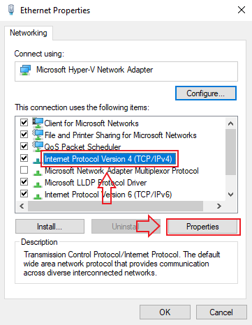
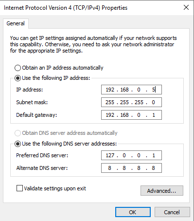
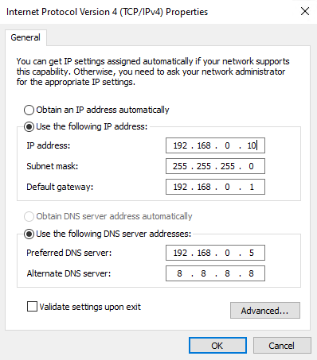

#### Setting IPv4 and DNS Network Settings in the Azure Lab Virtual Machines

These instructions allow you to do the following:

- Set up a NAT network within the Hyper-V lab machine so that your Windows 10 and Windows Server virtual machines can communicate with each other

- Configure the Windows Server VM and Windows 10 VM to have static IP addresses

- Allows the Windows 10 VM to use the Windows Server VM for DNS

#### Enabling PowerShell Execution Policy within the Hyper-V Lab Machine

First, we'll make sure PowerShell scripts can be run within our Hyper-V lab.

- Open PowerShell, run the following command, and select "Yes to All" to the prompt: 

  `Set-ExecutionPolicy RemoteSigned`

#### Hyper-V PowerShell Commands to Set Up a NAT Switch

Then, the following script will set up a virtual Hyper-V switch, configure it as a NAT network, and then add the two Windows virtual machines to it.

- Execute the following PowerShell [script](./HyperV_NAT_Setup.ps1) within the Windows host Hyper-V lab machine:

  ```PowerShell
  New-VMSwitch -SwitchName "NATSwitch" -SwitchType Internal
  New-NetIPAddress -IPAddress 192.168.0.1 -PrefixLength 24 -InterfaceAlias "vEthernet (NATSwitch)"
  New-NetNAT -Name "NATNetwork" -InternalIPInterfaceAddressPrefix 192.168.0.0/24
  Get-VM "Windows Server" | Get-VMNetworkAdapter | Connect-VMNetworkAdapter -SwitchName "NATSwitch"
  Get-VM "Windows 10" | Get-VMNetworkAdapter | Connect-VMNetworkAdapter -SwitchName "NATSwitch"
  ```

- You can either run this as a script within the Windows Hyper-V host lab machine OR execute the commands one by one by pasting them into PowerShell.

#### Configuring Network Adapter IPv4 Settings for Both Virtual Machines

**IMPORTANT NOTE**: DO NOT EDIT THE ADAPTER SETTINGS WITHIN YOUR MAIN _**WINDOWS HYPER-V RDP HOST**_. EDIT _**ONLY**_ THE ADAPTER SETTINGS WITHIN THE TWO _VIRTUAL MACHINES_ _INSIDE_ THE HYPER-V MANAGER OR YOU WILL BE LOCKED OUT OF YOUR LAB

Set the following IPv4 configurations within your Windows 10 VM and Windows Server VM network adapters, using the accompanied pictures as references:

#### Setting Up Windows Server VM Static IP Address

For the quickest way to open the `Network Connections` control panel window:

- On the Windows Server virtual machine, press the Windows key (Options on Mac) and type `ncpa.cpl` and hit enter. This will open the `Network Connections` window.

- Right-click the `Ethernet` network adapter and go to `Properties`

  - Under the `Ethernet Properties` menu, select `Internet Protocol Version 4 (TCP/IPv4)` and click `Properties`.

  

Enter the following settings and click `OK`.

#### Windows Server VM Network Adapter IPv4 Settings
- Use the following IP address:
  - IP address: `192.168.0.5`
  - Subnet mask: `255.255.255.0`
  - Default Gateway: `192.168.0.1`

- Use the following DNS server addresses:
  - Preferred DNS server: `127.0.0.1`
  - Alternate DNS server: `8.8.8.8`

  

#### Setting Up Windows 10 VM Static IP Address

For the quickest way to open the `Network Connections` control panel window:

- On the Windows 10 virtual machine, press the Windows key (Options on Mac) and type `ncpa.cpl` and hit enter. This will open the `Network Connections` window.

- Right-click the `Ethernet` network adapter and go to `Properties`

  - Under the `Ethernet Properties` menu, select `Internet Protocol Version 4 (TCP/IPv4)` and click `Properties`.

  

Enter the following settings and click `OK`.

#### Windows 10 VM Network Adapter IPv4 Settings
- Use the following IP address:
  - IP address: `192.168.0.10`
  - Subnet mask: `255.255.255.0`
  - Default Gateway: `192.168.0.1`

- Use the following DNS server addresses:
  - Preferred DNS server: `192.168.0.5`
  - Alternate DNS server: `8.8.8.8`

  

> **Important:** The `Preferred DNS Server` IP _must_ be set to the IP address of the 'Windows Server' machine. Without this setting, this client machine will not be able to join the Active Directory Domain in a later activity.

  - **Do not** click on `Validate settings upon exit`, as this may delete all your configuration settings. 

  - Click `OK.`

  - Run `ipconfig` in PowerShell, and verify that the settings have taken effect. 

  - Confirm Connectivity: 

    -  Within the Windows 10 VM, ping the Windows Server's IP address of `192.168.0.5` within PowerShell.
  
    If you get a response from these ping requests, you have set up your network connection correctly. 

> **Note**: These settings SHOULD persist through stopping and starting the Hyper-V lab, but if they do not, refer to this guide for setting up the network.