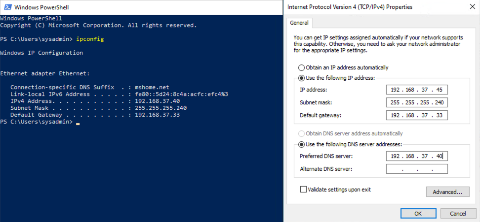
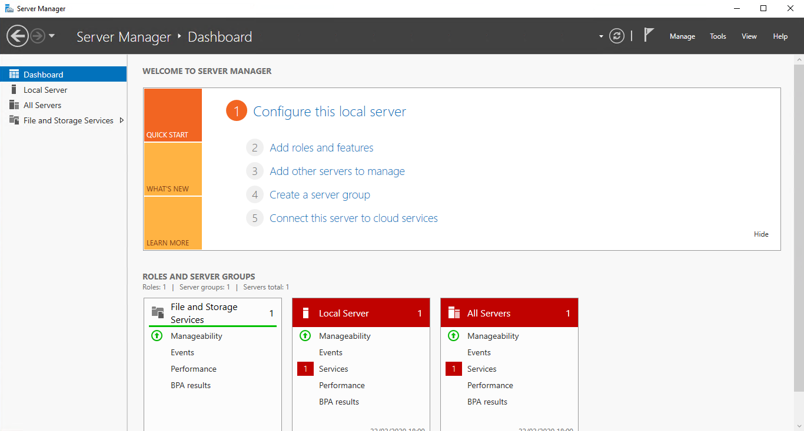
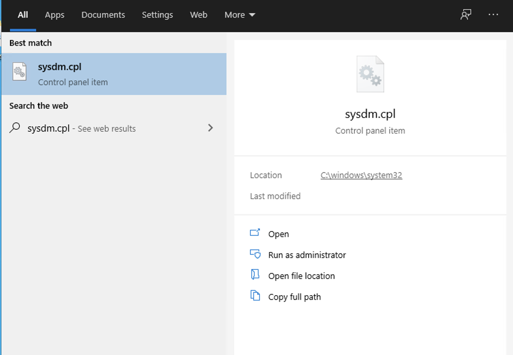
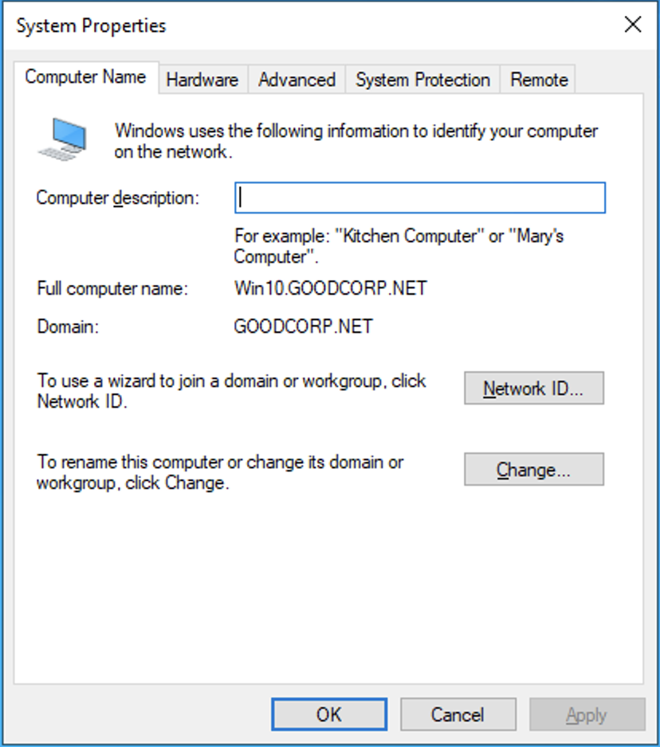
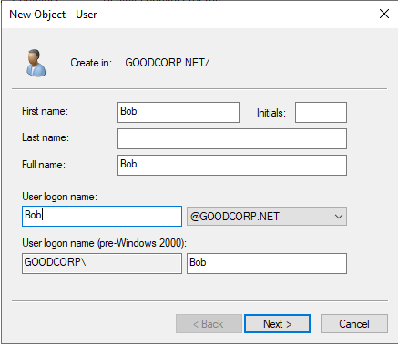
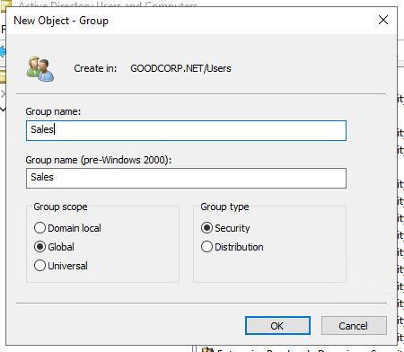
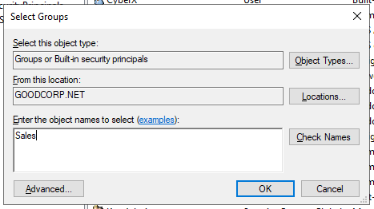
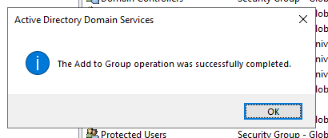
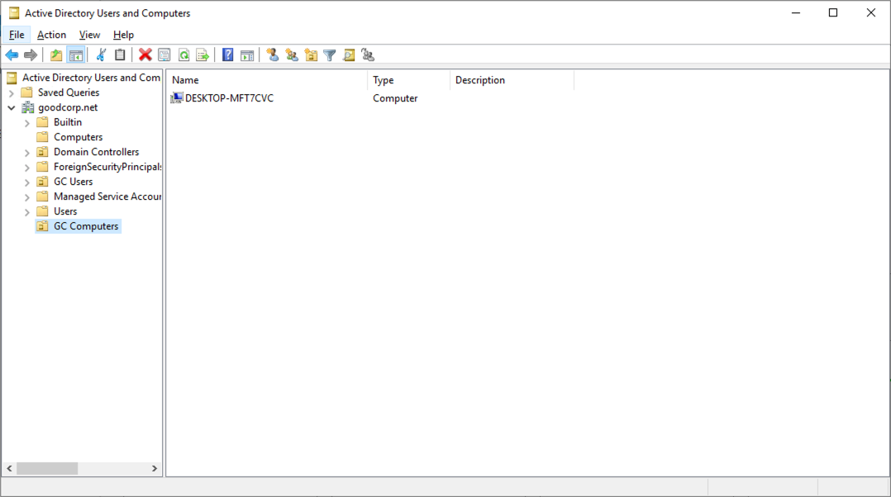

## 7.3 Student Guide: Windows Active Directory Domain Services
 
### Class Overview

In today's class, you will be learning how to manage and use **Active Directory Domain Services**.
 
### Lesson Objectives

By the end of the class, you will be able to:

- Set up an Active Directory server as a domain controller and joining a Windows host to it. 

- Create domain organizational units, users and groups. 

- Setting up group policy objects. 

### Lab Environment

In today's class we will be using the Windows Server for the setup with Active Directory, and the **Windows 10 Hyper-V** virtual machine as the client. 

Use the following credentials for each:

- Windows Server VM:
  - Username: `sysadmin`
  - Password: `p4ssw0rd*`

- Windows 10 Hyper-V VM:
  - Username: `sysadmin`
  - Password: `cybersecurity`

#### Saved State Clearing

**NOTE:** Hyper-V VM's should be shut down after every session to avoid the HyperV Machine going into a hibernation known as a 'Saved State'. If a machine goes into a saved state, you may see the error `The application encountered an error while attempting to change the state of the 'VM-Name'.` 

If you see this error, the VM may not startup until you _delete the saved state_. Turning the VM's and the host machine off when not in-use will avoid this troubleshooting overhead.

To delete the saved state, run the following PowerShell line to clear the Hyper-V virtual machine _saved states_:

- `Get-VMSnapshot | Remove-VMSavedState`.

**NOTE:** If you are unsure how to launch PowerShell, click on to the bottom left `Start` menu button and type "PowerShell".

**NOTE** that if, at any point, you come across an error that says `The application encountered an eror while attempted to change the state of...` when starting up your virtual machines, you rill need to run `Get-VMSnapshot | Remove-VMSavedState` again.

After deleting the saved state, you can turn on the **Windows 10** and **Windows Server** virtual machines by running:

  - `Get-VM | Start-VM`

#### Speeding up the Windows 10 VM

The Windows 10 virtual machine may seem slow and unresponsive. If this is the case for your class, run the following steps within the Windows 10 VM:

- Open `Task Manager` by going to the Start menu and typing "Task Manager" and hitting enter.

- Go to the `Startup` tab and click the `Microsoft Windows Based Host Script` and then click `Disable`.

  - Disable the rest of the `Startup` items for improved performance, as desired. This includes items such as `Steam` and `Skype`.

- Reboot the Windows 10 virtual machine.

### Lesson Slide Show

The lesson slides are available on Google Drive here: [7.3 Slides](https://docs.google.com/presentation/d/1c7s89y3uYQLeLUjn7V4zbIxo4n1OGlR4WwKPeKZJuoY/edit#slide=id.g4f80a3047b_0_990)

### 01. What are Active Directory Domains? (0:25)

Now that we have some familiarity with PowerShell, Microsoft's scripting language, we're going to learn how to set up and manage **Active Directory Domain Services** (also referred to as **Active Directory**, and abbreviated as **AD**), the central databasing system for enterprise-scale Windows environments.

An understanding of AD is critical knowledge for anyone working on Windows-based system administration and security.

The majority of roles in security fields interact with AD in some form or another:

- Security analysts, threat hunters, and incidence responders will be required to know AD to work with any company that interacts with Windows-based environments.

- Experts in penetration testing, threat intelligence, and malware reverse engineering will need to leverage vulnerabilities and execute exploits in poorly implemented AD configurations.

#### What is Active Directory and Why Do We Use It?

Suppose a small startup with 20 employees recently received a large amount of funding, after which they hired 100 more employees. 
- When the company was smaller, everyone helped each other out and had access to the same resources. 

- But for organizational and security reasons, the company must now be more strict about who can access resources. They must ensure everyone can access what they need, and can't access the things they don't need.

For example:

- Accountants need access to sensitive files containing banking numbers.

- IT teams need access to networking components like switches and routers.

- Everybody should have access to the printer.

- No guests should be able to access the network. 

The files, networking components, and printers are all **resources** that require permission to access. Because of the diverse roles and responsibilities of each employee, access is only given to those who need it.

The users, groups, machines, and permissions and policies assigned to them are known as **security principals**.

Active Directory is the system that helps us manage these resources and security principals by enforcing **authentication** and **authorization**. 
- Authentication proves you are who you say you are, using a password, token, or biometric key.

- Authorization either allows or denies access to material. 
  -  Think about what we learned during the Linux weeks related to file permissions. AD uses these same principals to help keep confidential documents secure. 

AD is also useful in the following areas: 

- Compliance: A domain controller can help organizations stay in compliance by implementing controls, which are crucial for passing security audits. An example of a control is implementing password policies to protect users from account compromise.

- Risk management: A properly managed domain can help reduce organizational risk. This includes managing and enforcing user access, password, and group policies to implement organizational compliance controls. Risk management can tie directly to business functions such as finance, and to external parties such as insurers, who will use risk levels to determine premiums and coverage.

- Access control: Access to files and directories are each managed by Access Control Lists (ACLs). These identify which entities (known as _security principals_), such as users and groups, can access which resources. ACLs use security identifers to manage which principals can access which resources.

AD is all the services that work together to manage authentication and authorization within a Windows Server network.

In AD, everything within a network is considered an **object**.

- Objects are users, groups, and computers, as well as the file shares, network printers, and other resources that  users need access to. 

- This means that all the factors in startup scenario mentioned earlier are considered objects, including:

  - Resources like printers, financial data, networking components, and mailboxes.

  - Security principals such as the accounting groups, guest users, and hot desk machines. Note that every security principal has a security identifier.

  - Just like in PowerShell, AD objects have attributes that describe properties of the objects. For example, the user object Bob might have an associated email attribute, `bob@goodcorp.net`. We'll explore this more in depth later.

Before we can understand how AD works, let's discuss what a Windows Server domain is.

#### Windows Domains and Domain Controllers

A **Windows Server domain** is a digital grouping of all object types, such as the users, computers, network resources, and security principals in an enterprise. These objects are managed by a server called a **domain controller**.

A domain controller is a server that manages access to all the domain resources. The domain controller has Active Directory installed and handles all authentication requests for these resources. The domain controller uses a database to verify authentication requests.

#### Active Directory Architecture

The Active Directory framework has multiple levels. These include **organizational units**, **groups**, **trees**, and **forests** :

- **Containers**: Virtual collections of objects.

- **Organizational unit (OU)**: Collections of objects that have policies applied to them. These collections typically relate to business functions. For example, user objects within the `accounting.GoodCorp.net` OU should only include users in the accounting department. OUs are not considered security principals.

- **Groups**: Also collections of objects such as users, computers, and other resources. Groups are used to manage identical permissions and access controls for security purposes, and to manage email distribution groups. Groups are considered security principals and use authentication to access resources.

  - There are two types of groups in AD:

     1. **Distribution groups**: Used to create email distribution lists for mail services such as Microsoft Exchange.

     2. **Security groups**: Used to assign permissions (or, access controls) to shared resources. We'll learn more about access controls when we get to Group Policy Objects.

- **Tree**: Collection of one or more domains and domain trees. For example, `accounting.GoodCorp.net` and `sales.GoodCorp.net` are child trees in the larger `GoodCorp.net` tree. The admin of the top-level of a tree is called the `domain admin`. A `GoodCorp.net` domain admin would have AD control over all domains within the `GoodCorp.net` tree.

- **Forest**: Two or more trees that are part of the same AD configuration. For example, a forest of domains might include `GoodCorp.org`, `GoodCorp.com`, and `GoodCorp.net`. The trust relationship between the domains allows `GoodCorp.net` users to interface with `GoodCorp.com` hosts if needed. The administration group for the entire forest of domains for an organization is called `enterprise admins`. This group controls AD for all the Good Corp domains.

#### Active Directory Authentication

Active Directory uses protocols, such as NTLM and Kerberos, to ensure that only the proper users can access the resources in the domain. Kerberos, the most commonly used authentication protocol, is considered one of the stronger methods of credential and authentication management. It is one of the reasons AD is so widespread.

- **LDAP** (Lightweight Directory Access Protocol) is a standardized protocol used for adding, deleting, and editing objects within AD. Think of AD as a journal of information, and LDAP as the pencil and eraser.

- **Kerberos** is a ticket-based authentication protocol that is now the default authentication protocol for Windows Server domains. It provides direct encrypted sessions between users and networked resources, which protect users from external and internal threats.

- **NTLM** (New Technology LAN Manager), like Kerberos, is an authentication protocol. It is now outdated due to pass the hash attacks. We will look at hashes more in our unit on cryptography. We will also discuss pass the hash attacks in the unit on penetration testing.

Let's look at exactly how Kerberos works. We'll use the example of a user, Bob, attempting to access a networked file server.

When Bob first signs into the domain using Kerberos:

1. Bob's Windows 10 machine sends a request to authenticate to the **Key Distribution Center (KDC)**, seeking a **Ticket Granting Ticket (TGT)**.

   - A Key Distribution Center has a database of valid credentials, an **Authentication Server**, and a **Ticket Granting Server (TGS)**.

2. Once Bob's credentials are verified, he receives a Ticket Granting Ticket that allows him to request access to resources. That Ticket Granting Ticket is cached (or, stored), and permits him to request more tickets for the current domain session.

3. When Bob attempts to access the file server, he sends the Ticket Granting Ticket to the Ticket Granting Server, requesting access to the file server.

4. The Key Distribution Center then checks to see if the file server exists and if the Ticket Granting Ticket is valid. If it is, the Key Distribution Center sends Bob an encrypted **service ticket** containing the _past_ information he authenticated with earlier, and a **session key**. Bob is then sent the encrypted service ticket and a copy of the session key. Bob _cannot_ access the contents of the service ticket—only the file server can.

5. Bob then uses the session key to encrypt a new message containing his _current_ information and sends that, along with the service ticket, to the file server.

6. The file server then decrypts the service ticket containing the session key, and uses that session key to decrypt the message from Bob containing his _current_ information. 
   - If the service ticket's _past_ information about Bob matches the message containing Bob's _current_ information, the file server verifies that it is in fact **Bob** requesting access.

7. Lastly, the file server uses the session key to encrypt a new message to be sent to Bob containing information about the file server. If Bob's existing copy of the session key properly decrypts the message, the file server is verified to be the same file server Bob requested access to.

### 02. Updating Network Settings on the Windows 10 Hyper-V Machine 

In a real work environment, we will have static IP addresses for all of the computers that will connect to the Active Directory domain. We will not go into the specifics of networking today, but will cover networking in depth in a future week. 

**Setting Up Static IP Addresses**

On the Windows Server open PowerShell and run `ipconfig`. 

On the Windows 10 Hyper-V machine, explain the following:
- We need to make sure that our machine is discoverable by other machines on the network. 
  - Open `Control Panel` > `All Control Panel Items` > `Network and Sharing Center` > `Advanced sharing settings`.

  - Uncheck the `Turn on Network Discovery` checkbox for Private and Public/Guest profiles. Save the changes and exit.

- Next we need to set up our static IP address and DNS server based on our Windows Server. Complete the following steps:
  - Click `Start Menu` > `Control Panel` > `Network and Sharing Center` or `Network and Internet` > `Network and Sharing Center`.
  - Click `Change adapter settings`.

  - Right-click on `Wi-Fi` or `Local Area Connection`.
  - Click `Properties`.
  - Select `Internet Protocol Version 4 (TCP/IPv4)`.
  - Click `Properties`. 
  - Select `Use the following IP address`.
  - Look at your **Windows Server** PowerShell terminal to copy the following network configuration onto your Windows 10 Hyper-V machine:
    - Subtract one digit from the last number of the **Windows Server** IPV4 address, and place the new address to the IPV4 Address and use that as your **Static IP address**.

    - Copy the **Subnet Mask** exactly as it is.

    - Copy the **Default Gateway** exactly as it is.

    - Check on `Use the following DNS server addresses` and enter the IPV4 address of the **Windows Server** machine for the `Preferred DNS server`. 
    
    - **Do not** add anything to the `Alternate DNS server`. Your configuration should similar to the image below:
  

> **Important:** The `Preferred DNS Server` IP _must_ be set to the IP address of the 'Windows Server' machine. Without this setting, this client machine will not be able to join the Active Directory Domain in a later activity.

  - **Do not** click on `Validate settings upon exit`, as this will delete all your configuration settings. 

  - Click `OK.`
  - Run `ipconfig` in PowerShell, and verify that the settings have taken effect. 
  - Confirm Connectivity: 
    -  Ping the Windows Server's IP address.
    -  Ping `goodcorp.net` 

### 03. Instructor Do: Setting up an Active Directory Domain Controller and Joining the Domain Demo (0:20)

Using Active Directory allows us to both efficiently create and manage a growing number of Windows users, as well as implement specific access controls and policies to secure our Windows environment.

For this demo, we will set up a Windows Server as an AD server in order to manage our current and future Windows users:

In the Windows Server 2019 machine, we will: 

  - Add the Active Directory Domain Services role to our Windows Server 2019 machine.

  - Promote the AD server to a domain controller.
  
    - If the `Add Roles and Features Wizard` window is closed before promoting the server to a domain controller, an exclamation point icon will appear near the flag at the top right of the `Server Manager` window. Click this notification and select `Promote this server to a domain controller`.

  - Add a forest.

  - Set the forest and domain levels.

  - Set a restore mode password.

Then, in the Windows 10 machine, we will: 

  - Join the domain using the Admin account credentials.

#### Verify the Environment

First, make sure we're working out of our Windows 10 RDP session:

  - Open the Windows Server RDP session and log in with the credentials, username: `sysadmin` and password: `cybersecurity` if not already set.

#### Setting Up Windows Server 2019 as an Active Directory Domain Services Domain Controller

We'll now install the Active Directory Domain Services role.

- Make sure you are in the `Server Manager` window.

Notice the options at the top right of the `Server Manager` page. This is the GUI area where they will the `Tools` and `Manage` menu links for Windows Server and Active Directory.

- Click `Local Server` (under `Dashboard`) on the left side of `Server Manager`.

- At the top right of the `Local Server` window, click `Manage`, then go `Add Roles and Features`.

- On the `Add Roles and Features Wizard` screen:

  - Click `Next >`

- On the `Select installation type`:
  - Select `Role-based or feature-based installation` and click `Next >`.

- On the `Select destination server` screen under `Select a server from the server pool` should be the current server, `WinServer2019` (or `ad`). 
  - Click `Next >`

- On the `Select server roles` prompt: 
  - Click the `Active Directory Domain Services` role. A new window `Add Roles and Features Wizard` will pop up. 

  - Click `Add Features`.

- Back at the `Select server roles` screen, expand `File and Storage Services` and then expand `File and iSCSI Services`.

  - Check `File Server`.

  - Click `Next >`

- The default features on the `Select features` screen should be correct. Click `Next >`.

- On the `Active Directory Domain Services` page, click `Next >`.

- On the `Confirm installation selections` screen, select `Install`.

  - Keep the next screen, `Installation progress`, open.

At this point, this Windows Server 2019 machine is setting up to become an AD server. It still needs to be promoted to a domain controller so it can handle authentication requests.

#### Promoting the Domain Controller

On the `Installation progress` screen, after the `Active Directory Domain Services` role is done installing, click the new link titled: `Promote this server to a domain controller`.

- **Note**: If the `Add Roles and Features Wizard` window is closed before promoting the server to a domain controller, an exclamation point icon will appear near the flag at the top right of the `Server Manager` window. Click this notification and select `Promote this server to a domain controller`.

- A new `Active Directory Domain Services Configuration Wizard` window will appear.

Since no internal Windows domain currently exists for the company Good Corp, Inc., we'll create it. We'll need to create a single domain forest, using the company's website `GoodCorp.net`. Note: this website doesn't actually exist, and is just for demonstration purposes.

- On the `Deployment Configuration` screen, click `Add a new forest`.
 
- In the `Root domain name` form, type `GOODCORP.NET` and click `Next >`.

Explain to students that these settings allow for backwards compatibility with older Window Servers domains. That isn't an issue for us because we do not have any existing domain controllers. Therefore, we will be using `Windows Server 2019`, which is functionally, the exact same as `Windows Server 2019`. 

@@@TODO: Isaac, ^^^ one of these `Windows Server 2019` should be something else? ^^^

- On the `Domain Controller Options` screen, make sure the following settings are set:

  - `Forest functional level:`  `Windows Server 2016`

  - `Domain functional level:`  `Windows Server 2016`

  - Do not change settings under `Specify domain controller capabilities`.

`Directory Services Restore Mode` is a type of special boot mode, like `Safe Mode`, where you can recover Active Directory resources, such as accidentally deleted objects.

  - Set the `Directory Services Restore Mode (DSRM) password` to `p4ssw0rd*`. 

  - Click `Next >`

- On the `DNS Options` screen, note the notification at the top.

  - The notification at the top of the screen means that the server cannot find any DNS records, because we did not set up a DNS server for our demonstration website, `GoodCorp.net`. Click `Next >`.

- On the `Additional Options` screen, the `NetBIOS domain name` will automatically populate.
  
  - The `NetBIOS domain name` is usually the same as the `Computer name`. 

  - NetBIOS provides Windows name resolution services. DNS is more commonly used now, but NetBIOS is usually set to ensure backwards compatibility.
  
  - Click `Next >`

- Once on the `Paths` screen, notice the following default paths:

    - The `Database folder` contains the AD database.

    - The `Log files folder` contains log files for AD.

    - The `SYSVOL folder` contains public files needed by clients, and is synced between domain controllers.

-  Click `Next >`

- On the `Review Options` screen, we can save this AD configuration as a PowerShell script so it can be set up on future servers.

  - Click `View script` then save the script to the `C:\Scripts` directory.

    - This PowerShell script can be run on a Windows Server machine to set up AD without having to go through the Active Directory Domain Services Configuration Wizard.

  - Click `Next >`

- On the `Prerequisites Check` screen:

  - There may be notifications for static IP and DNS, but we can ignore these for now.

  - After you see the message  `All prerequisite checks passed successfully.`, click `Install`.

  - After a few minutes, `Active Directory Domain Services` should be fully installed. 

After successful installation, you will need to reboot the server. A `You're about to be signed out` notification may appear. Click `Close` if it does.

Now, we need to add the Windows 10 PC to the Windows Server.

#### Joining the Windows 10 Computer to the Domain

Now we have a domain controller we can connect to, but to manage the Windows workstations, we have to connect each one to the domain. 

- Switch to the Windows 10 machine. 

We need to get to the `System Properties` window.

- Click in the `Search` area.

- Type in `sysdm.cpl` and the `sysdm.cpl` `Control panel item` should appear. Make sure it's selected. This will look like:

  

- Hit enter to open the `System Properties` screen.

The `System Properties` screen will appear. 

- The properties will show that the computer is set as a `Workgroup` and not a `Domain`. Computers are set as `Workgroup` by default. `Workgroup`s are for simple home networks.

- Click on the `Change` button to set the machine as `Domain`.

After we put in our domain's name, we should see a login screen where we can log into a domain account.

- In the `Computer Name/Domain Changes` window that appears, click the radial button next to `Domain`, type in `goodcorp.net`, and hit enter or `OK`.

- A new screen for credentials should appear. Use the following credentials and then hit `OK`:

  - Username: `azadmin`
  - Password: `p4ssw0rd*`

If you enter the credentials correctly, you should see a `Welcome to the goodcorp.net domain.` message.

- Click `OK`

You will be notified that the computer needs to restart in order to apply the settings.

- Click `OK` on this window.

**Note**: As suggested by the prompt, make sure to save any open scripts that you have changed.

- Enter `OK` on the `Computer Name/Domain Changes` window to close it.

- Enter `Close` on the `System Properties` window to close it. A new window will appear.

This window will tell you the computer needs to restart to apply changes.

- Enter `Restart Now`

**Note**: Once the Windows 10 computer is set up with the domain, we can start using the Windows Server domain controller to manage users, groups, files, etc. for the Windows 10 machine.

**Note**: This process can **take up to five minutes**.

- Once your Windows 10 VM has restarted, run `sysdm.cpl` from the search area again.

- Now the domain shows up in the `System Properties` screen:

  

We just created an Active Directory Domain Controller and joined our Windows 10 computer to it!

### 04. Setting up an Active Directory Domain Controller and Joining the Domain 

- [Activity File: Setting Up an Active Directory Domain Controller](Activities/03_Create_AD/Unsolved/README.md)

### 05. Review Setting up an Active Directory Domain Controller and Joining the Domain 

- [Solution Guide: Setting Up an Active Directory Domain Controller](Activities/03_Create_AD/Solved/Readme.md)

### 06. Instructor Do: Creating Domain OUs, Users, Groups (0:15)

In this section, we will set up our domain with a user and group.

For this demo, we will continue our system administration tasks and set up users in Active Directory so they have accounts that are logically assigned to Organization Units and Groups. 

- We need to set up sales associate Bob in the AD. 

- To do this, we will need to create organizational units (OUs), users, and groups.

We will complete the following tasks:

- Create a new domain organizational unit called `GC Users`.

- Create a sub-OU called `Sales`.
- Create a user, `Bob`, under the `GC Users > Sales` OU.

- Create a group, `Sales`, under the `GC Users > Sales` OU.

#### Creating OUs 

At the top-right of the `Server Manager`, click `Tools`, and open the `Active Directory Users and Computers` (`ADUC`) tool.

- We use this tool to manage user and computer objects within a domain. We will be creating our users, groups, and organizational units with this tool.

- OUs are logical groupings of an organization's assets and accounts, used to manage these assets together. For example, all the computers in the sales department of a company should be grouped together in an OU. This OU might be called `GC Users > Sales`. All of the computers in this OU have the same policy, which is set by the group policy.

- OUs allow us to distinguish computer objects based on how they are functionally associated with one another within the organization.

- OUs allow us to apply custom permissions, rules, and settings for users and groups in the domain through Group Policy Objects, which are collections of policy settings. We will learn more about these later. For now, we will look at creating OUs.

With `ADUC` still open, complete the following steps:

- Right-click `GOODCORP.NET`, go to `New`, then `Organizational Unit`.

- Name this OU `GC Users` (short for Good Corp, Inc.).

We now have a top-level OU to hold all of our domain's users. Now we need to add a layer of organization to distinguish users. 

Let's create the `Sales` sub-OU.

- Right-click `GC Users`, then click `New`, then `Organizational Unit`.

- Enter `Sales` for the name and click `OK`.

We now have a sub-OU for our sales team. This will include our `Sales` team users, who will all have the same policies applied to them. 

Now, lets add some users. 

#### Creating Users

Users are the domain accounts that people log in with. Let's look at how to create the user `Bob` under the `Sales` organizational unit we just created.

With `ADUC` still open, complete the following steps:

- Expand the `GC Users` OU, right-click the `Sales` OU, then `New`, then `User`. A `New Object - User` window will appear.

- In the `New Object - User` window, type `Bob` for the first name and for the `User logon name`.

  - 

There aew various fields you can enter for a user. Some organizations choose to use the `Last name initial, first name` as the user account.

- To make it simple, and because our own domain won't be nearly as large as our clients', we are going to just use first names as the username, followed by `@GOODCORP.NET`.

- Click `Next >`

The next screen will have fields for setting Bob's password and a few password settings for sysadmins to set.

- Set the password to `Ilovesales!`.

- Uncheck `User must change password at first logon`.

- You don't have to check any other boxes here.

In a real world scenario, we would have our user reset their password on their first logon. We are keeping the names the same so we can test the user later.

- Click `Next >`

- The next screen shows the settings you chose. It should have the following:

  - Full name: `Bob`

  - User logon name: `Bob@GOODCORP.NET`

- Click `Finish`

- Double-click on the `GC Users > Sales` OU (the folder icon), and point out our newly created user, `Bob`.

Now that we have Bob's domain account set up, we're going to add them to a group.

#### Creating Groups

Groups are collections of objects that require authorization to access resources.

Groups are different from organizational units in the following ways:

1. You can link group policies to OUs, but not groups.

2. You can give file, folder, sharing, and other resource permissions to groups, but not OUs.

3. Groups have security identifiers, but OUs do not.

Groups are used for managing permissions to resources, while organizational units are used for linking policies to a set of objects, and for administration purposes. 

Specify that users can belong to many groups, but are only part of one OU. OUs are organizational tools.

- For example, the `Bob` domain account belongs under the `Sales` organizational unit, but the user `Bob` can be in the `Salesforce` _and_ `Customer Service` groups.

- The groups allow Bob access to `Salesforce` and `Customer Service` resources such as networked file shares, while, the `Sales` OU will have the `Sales` Group Policies applied to these accounts. 
   - A policy might be "no access to Windows control panel," meaning users in the `Sales` OU won't be allowed access to Windows control panel to change system settings.

With `ADUC` still open, complete the following steps:

- Right-click the `GC Users > Sales` OU, then go to `New`, then `Group`.

- Set the `Group name` to `Sales`. Leave `Group scope` as `Global` and `Group type` as `Security`.

   

- Note the following scopes:

  - `Universal` groups exist in the domain forest. If we also own the domains `GoodCorp.com` and `BadCorp.net` and they share a transitive trust relationship, user accounts in universal groups can use resources in all of these domains.

  - `Global` groups are set up to contain multiple users with identical permissions. Global groups are usually lists of users.

  - `Local` groups are best used when their objects only need access to specific resources.

- Click `OK`

A new group, `Sales`, will appear in the `GC Users > Sales` OU. We need to add `Bob` to `Sales` now.

- Right-click `Bob` and go to `Add to a group...`.

- In `Select Groups`, type `Sales` in the `Enter the object names to select` field.

  

- Click `Check Names`

  - `Sales` becomes underlined, meaning the system found the group.

- Click `OK`. A new screen will appear saying `The Add to Group operation was successfully completed.`

  

- Click `OK`

 `Bob` is now part of the `Sales` group in our domain. Later, we will set up the `Sales` group permissions.

### 07. Creating Domain OUs, Users, Groups 

- [Activity File: Creating OUs, Users, and Groups](Activities/06_Creating_OUs_Users_Groups/Unsolved/README.md)

### 08. Review Creating Domain OUs, Users, Groups 

- [Solution Guide: Creating OUs, Users, and Groups](Activities/06_Creating_OUs_Users_Groups/Solved/Readme.md)

### 09. Creating Group Policy with Group Policy Objects Demo 

We set up these users and their associated OUs and groups, and can now create some policies that will distinguish them from one another.

- We use Group Policy Objects to implement the principle of least privilege, giving users only the access they need, in order to keep a threat's attack surface area as small as possible. 

  - For example, we can use a Group Policy Object to deny the `Sales` access to `Control Panel`, since members of the Sales team don't need to access this area of the system. 

- Group policies manage and apply multiple policies at the same time. One change to a group policy can take effect on all the OUs the policies are applied to.

  Consider the following scenario: 

  - Recently, all of the accountants at your company had their passwords leaked. 

  - After securing the vulnerability that was exploited, you can assign the accounting OU, which consists of over 1,000 accounts, a policy that resets all users' passwords and requires every accountant to set a new password on their next logon. 

To pass a group policy to an OU, we need a Group Policy Object.

- A Group Policy Object (GPO) is a package of policy settings applied to OUs in our domain. GPOs are the cornerstone of policy management in Active Directory.

- Multiple group policies are often combined into one GPO. 

For example: If you wanted to not only require accountants to have password complexity requirements, but also wanted to deploy an anti-malware software when they next log on, you can combine these two policies into one Group Policy Object called "Better Password and Anti-Malware Setup," and apply it to all the accountants in the OU.

#### Creating Group Policy with Group Policy Objects Demo

We want our Sales team to have limited access to Windows Control Panel. Control Panel allows a user to change vital system settings on their machine, and we are also worried that members of the Sales team might make mistakes if they try to troubleshoot a problem on their own.  

In this demo, we will deny the Sales team access to the Control Panel. 

In order to do this, we will need to: 

- Create a Group Policy Object.

- Link the Group Policy Object to an organizational unit.

Begin by opening the `Group Policy Management` tool.

- Make sure that you're connected to the `Windows Server 2019` RDP session before continuing.

- With the `Server Manager` open, click on `Tools` at the top-right.

- Select the `Group Policy Management` tool. The `Group Policy Management` window will appear.

The left pane of the `Group Policy Management` window has a similar setup to where we saw our domain and OUs.

Click on the following:

- In the `Group Policy Management` click on `Forest.` Move through `GOODCORP.NET`> `Domains` >  `GOODCORP.NET`. 

- Right-click `Group Policy Objects` under `GOODCORP.NET` and click `New`.

In the `New GPO` window, type `No Control Panel` for the `Name:`.

- Click `OK`

Point out `No Control Panel` under `Group Policy Objects`.

We just created a Group Policy Object. But, it doesn't have any actual policies in it yet. We'll look at how to do that now.

- Right-click the `No Control Panel` GPO and click `Edit`. The `Group Policy Management Editor` window will open.

This is where you select the policies to add to your GPO.

- Navigate to `User Configuration`, then click on `Policies`, then click `Administrative Templates`, and then `Control Panel`. On the right-side pane, there will be default policies you can edit.

- Double-click the `Prohibit access to Control Panel and PC settings` policy. It will open the `Prohibit access to Control Panel and PC settings` window.

This is the policy to deny access to the `Control Panel` on Windows systems.

- Select `Enabled`, then press `Apply`, then `OK`.

- Close the `Group Policy Management Editor` window.

At this point, we have created a Group Policy Object with a single policy that denies access to the Control Panel. Now we need to apply it to the Sales team OU, which will acquire GPO links. 

Move to `Group Policy Management` window and link the GPO to the OU. 

- With the `Group Policy Management` window open, move through the following: `Group Policy Management` > `Forest` > `Domains` > `GOODCORP.NET` > `GC Users`
  
- Right-click the `Sales` OU under `GC Users` and select `Link an Existing GPO...`. The `Select GPO` window will appear.

We can now apply the `No Control Panel` GPO we created.

- Click on `No Control Panel` and click `OK`.

We have now applied the `No Control Panel` GPO to the `GC Users > Sales` OU.

### 10. Creating Group Policy with Group Policy Objects Activity

- [Activity File: Creating Group Policy with Group Policy Objects](Activities/09_Group_Policy_Objects/Unsolved/README.md)

### 11. Creating Group Policy with Group Policy Objects Review 

For your activity, students were tasked with creating a `Group Policy Objects` to restrict the `Sales` team from accessing Windows `Control Panel`.

To review, see if all the students properly created the Group Policy.  Send students the following solution guide anf review if necessary: 

- [Solution Guide: Creating Group Policy with Group Policy Objects](Activities/09_Group_Policy_Objects/Solved/Readme.md)

### 12. Domain Hardening with GPOs 

For this upcoming demo, we will implement a GPO to improve the security of our Windows machine.

- For this group policy, we're looking to disable Local Link Multicast Name Resolution (LLMNR), a protocol that helps computers find other computers in a network.

- The steps to create this group policy will be the same as the previous demo. We will create the GPO and then attach it to an OU. We will also explore the security implications of LLMNR as we create the GPO.

#### Adding our Windows 10 Machine to an OU Demo

Before we can secure our Windows 10 machine with GPOs we need to add it to an organizational unit. We're going to call the OU `GC Computers`, and it will live on the same level as the OU `GC Users`.

- With `Active Directory Users and Computers` tool open, do the following:

  - Right-click `GOODCORP.NET`, go to `New`, then `Organizational Unit`.

  - Name this OU `GC Computers` and reiterate that `GC` is just an abbreviation for our company, Good Corp, Inc.

We now have an OU to put all of our domain's computers in.

- Click and drag the Windows 10 machine from the default `Computers` directory to the new `GC Computers` OU. A warning will appear explaining that changing OUs can disrupt previous settings: "Are you sure you want to move this object?" Click `Yes`.

When done successfully, it will like the following:

We can now apply GPOs to the `GC Computer` OU.

#### Disabling Local Link Multicast Name Resolution (LLMNR) Demo

We're going to look at one of the attack vectors that can exist in a domain.

- Open the following link: [MITRE ATT&CK™ - LLMNR Vulnerability](https://attack.mitre.org/techniques/T1171/)

MITRE is one of the world's leading organizations for threat intelligence in cybersecurity. 

- They maintain the Common Vulnerabilities and Exposures database, a database that catalogs officially known exploits. 
- They also maintain what we're looking at now, the MITRE ATT&CK database, which catalogs attack methods and signatures of known hackers.

We are going to disable Local Link Multicast Name Resolution (LLMNR) on our Windows 10 machine, since it is considered a vulnerability.

- Local Link Multicast Name Resolution is a protocol used as a backup (not an alternative) for DNS in Windows. 
- When Windows cannot find a local address (e.g. the location of a file server), it uses LLMNR to send out a broadcast across the network asking if any device knows the address. 
- LLMNR’s vulnerability is that it accepts any response as authentic, allowing attackers to poison or spoof LLMNR responses, forcing devices to authenticate to them. An LLMNR-enabled Windows machine may automatically trust responses from anyone in the network.

Turning off Local Link Multicast Name Resolution for the `GC Computers` OU will prevent our Windows machine from trusting location responses from potential attackers.

Click on the following to create this GPO:

- In the `Group Policy Management` click on `Forest` > `GOODCORP.NET` > `Domains:`> `GOODCORP.NET`. 
  - Right-click `Group Policy Objects` under `GOODCORP.NET` and click `New`.

- Create a new GPO called `No LLMNR`. Next, right-click `No LLMNR` and navigate to the following: `Computer Configuration` > `Policies` > `Administrative Templates` > `Network` > `DNS Client` > `Turn Off Multicast Name Resolution` 
  - Click `Apply`
  - Click `OK`

### 14. Student Do: Quick Hardening with Two More GPOs (0:25)

- [Activity File: Hardening with More GPOs](Activities/12_Domain_Hardening_GPOs/Unsolved/README.md)

### 15. Quick Hardening with Two More GPOs Review (0:10)

- [Activity File: Hardening with More GPOs](Activities/12_Domain_Hardening_GPOs/Solved/README.md)

---
© 2020 Trilogy Education Services, a 2U, Inc. brand. All Rights Reserved.