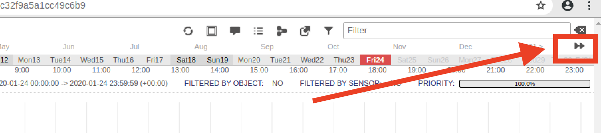

## 11.3 Student Guide: Enterprise Security Management (ESM)

### Overview

In today's class, you will advance their network security knowledge by learning enterprise security management (ESM) and how host-based OSSEC IDS technology plays a critical role in endpoint telemetry. You will expand their investigations of threats using Security Onion's Elastic Stack and the web-based data analytics visualization tool Kibana.

### Class Objectives

By the end of today's class, you will be able to:

- Analyze indicators of attack for persistent threats.

- Use enterprise security management to expand an investigation.

- Use OSSEC endpoint reporting agents as part of a host-based IDS alert system.

- Investigate threats using various analysis tools.

- Escalate alerts to senior incident handlers.

### Slideshow

The lesson slides are available on Google Drive here: [11.3 Slides](https://docs.google.com/presentation/d/1rv934scfnT3mZD-D7Rc8sJUqvdEfEoqVW06OtwbqUq4/edit)

___

### 01.  Welcome, Overview, and Lab Prep 

#### Security Onion Setup

In preparation for the labs, we will need to log into Azure and connect to the Network Security environment. After you are connected, launch an instance of Security Onion from the HyperV manager. This will generate alert data that will allow everyone to complete the labs.

Login with the following credentials:

- Username: `sysadmin`
- Password: `cybersecurity`

1. First, we will all verify that our network security monitoring (NSM) tools are 100% operational before starting the labs. Launch the terminal.

   Type the following command to check the status of currently installed NSM tools.

   - `sudo so-status`

   Output should look similar to below:

   

   - Ensure all statuses are `OK`.
   - If not, repeat the `so-status` command a few times. Sometimes it's slow.
   - If any of the statuses are not `OK` after a few minutes, restart Security Onion's NSM tool with the following command:

      - `sudo so-restart`

      - Keep running the `so-status` command for a few minutes. All systems should reflect `OK` after a few minutes.

#### Generate Alerts

2. Log into Sguil using the following credentials:

   - Username: `sysadmin`
   - Password: `cybersecurity`

   Verify that you still have their pcaps loaded from the previous class. If you do not, run the following command "replay" all PCAP files from previously captured malware:

      - `sudo so-replay`

      - It could take as long as 10 to 15 minutes for Security Onion to run all of the PCAPs.

   Run the following command to "replay" all PCAP files from previously captured malware.

      - `sudo so-replay`

      - It could take as long as 10 to 15 minutes for Security Onion to run all of the PCAPs.

**Note**: `so-replay` should be completed before starting the activity.

#### Network Security Recap

Today's class continues covering fundamental concepts and details of network security monitoring, intrusion detection, and Snort.

Let's begin by reviewing the basic concepts from last class and how they relate to professional roles:

- Firewalls protect networks by making decisions based on rules that are set by administrators. Firewalls are designed to allow traffic from trusted sources and block traffic from untrusted sources.

- Firewalls do have their limitations. Advanced hackers can easily fool them through packet manipulation.

   - For instance, an attacker can send malicious data through a firewall by hijacking or impersonating a trusted machine. This is why it's crucial to have a strong defense in depth methodology to help protect sensitive data.

**Intrusion detection systems** (**IDS**) are tools that can both analyze traffic and look for malicious signatures. An IDS is like a firewall that also reads the data in the packets it inspects, issues alerts/alarms, and blocks malicious traffic if configured to do so.

- There are many types of intrusion detection systems, but today's lesson will focus on **Snort**, the world's most popular open-source solution. 

- **Network security monitoring** (**NSM**) is the process of identifying weaknesses in a network's defense. It also provides organizations with situational awareness of their network.

- **Security Onion** is a specific Linux distribution that's derived from Ubuntu. Security Onion uses the Snort IDS engine solely as its event-driven mechanism.

This knowledge is essential for the following technical roles, among others:

- **Security analysts** are responsible for protecting all sensitive information within a company. Their main job is to analyze the security measures of a company, determine how effective they are, and devise ways to improve them.

- **Security Operations Center (SOC) analysts** work alongside security engineers and SOC managers. They provide situational awareness through the detection, containment, and remediation of IT threats. An SOC manages incidents for an organization and ensures they are properly identified, analyzed, and reported.

- **Network forensics** uncovers the source of security issues by monitoring and analyzing network events. 

### 02. Alert - C2 Beacon

While firewalls serve as an initial defense against attacks, they do have weaknesses.

NSM plays a critical role in implementing a defense in depth approach, serving as an additional layer of protection when an adversary bypasses defenses and is one step away from the targeted data.

#### Command and Control

We'll explore how Command and Control (C2) servers are used to create a specific type of alert against attacks that use persistence as part of its attack campaign.

- This type of attack has infected hosts make callbacks to C2 servers. These callbacks (referred to as "keep alives") serve as beacons that keep the back channel open to enable access in and out of the network at all times. 

These beacons activate a specific alert. In the screenshot below, we see an alert identified as a C2 beacon acknowledgement, which includes the text `CnC Beacon Acknowledgement` in the Event Message. 

- There is a reference URL specified within the Snort rule option.

   - Sometimes, writers of Snort rules will put links in their rule options to help network defenders establish TTPs regarding their attackers.

   - With this information, network defenders can form mitigation strategies to help improve their security posture.

### 03. C2 Beacon 

- [Activity File: C2 Beacon](Activities/04_C2_Beacon/Unsolved/README.md)

### 04. Review C2 Beacon Activity

- [Solution Guide: C2 Beacon](Activities/04_C2_Beacon/Solved/README.md)

### 05. Enterprise Security Monitoring 

Now that we've learned about the benefits of using firewalls and NSM, we must move from traditional network-based IDS engines, such as Snort, to the more all-encompassing **enterprise security monitoring** (**ESM**), which includes endpoint telemetry.

#### OSSEC

Firewalls and NSM cannot see inside of encrypted traffic. This is major limitation because:

- In most cases, malware will be transmitted from attacker to victim in an encrypted state, in order to hide its presence and intent. This also serves as a method of obfuscation to bypass IDS detection engines.

- Since malware cannot activate in an encrypted state, it must be decrypted. This can only happen after it is installed on the victim’s machine. This is where ESM and, more specifically, endpoint telemetry become relevant.

ESM uses OSSEC to provide visibility at the host level, where malware infection takes place after it's decrypted.

- OSSEC is the industry's most widely used host-based IDS (HIDS). It has many configuration options and can be tailored to the needs of any organization. 

- **Endpoint telemetry** as host-based monitoring of system data. 
   - OSSEC agents are deployed to hosts and collect syslog data. This data generates alerts that are sent to the centralized server, Security Onion. 

   - Security administrators can then use Security Onion to form a detailed understanding of the situation and reconstruct a crime.

#### Elastic Stack

OSSEC monitors all of the syslog data that it sees. However, not every syslog entry will generate an alert. Security admins will need to switch to other tools to fully analyze packet captures.

These other tools are known as the **Elastic (ELK) Stack**, the engine that operates within Security Onion. It consists of three important components:

1. **Elasticsearch** is considered the heart of the Elastic Stack. It is a distributed, restful search and analytics engine built into Security Onion that is capable of addressing thousands of data points seen within network traffic. It helps security administrators locate the expected and uncover the unexpected.

2. **Logstash** is an open-source, server-side data processing pipeline built into Security Onion. It ingests data from many sources at the same time by transforming it and sending it to designated log files, known as stashes.

3. **Kibana** is a browser-based visualization interface. It uses thousands of data points from the Elastic Stack as its core engine.

These tools work together with OSSEC to make a comprehensive alert data process:

1. OSSEC agents generate an alert.

2. OSSEC sends alert data gathered from syslog to Security Onion's OSSEC server.

3. The OSSEC-generated syslog alert is written to Logstash for storage.

4. Log data is ingested into the Elasticsearch analytics engine, which parses hundreds of thousands of data points to prepare for data presentation.

5. Users interact with the data through the Kibana web interface.

#### Investigation, Analysis, and Escalation Demo

In this demo we will discuss using several tools in the ELK stack. We will focus on how these tools work, and not a specific attack. 

- We will also focus on the process of escalation within a Security Operations Center:

   - A junior analyst working in a Security Operations Center will belong to a multi-tier group of analysts. Junior analysts typically perform the initial triage of alerts and then escalate these events to senior incident responders.

- This process and the tools involved will be our focus.

We'll begin our investigation with a new tool called Squert:

- Click on the Squert desktop icon and enter the same credentials you used for you Sguil login.

- After logging in, we may need to change the date range to ensure we see all the alert data in our system. Click on the date range as illustrated below.

   

- The default view shows alerts from today. In order to show older alerts, click **INTERVAL**, then click the **two right arrows** to set your custom date. 

   

In this example we'll change the year to 2014 in the **START** field. This date range should cover all alerts used in the PCAPs.

-  Click on the **circular arrows** to reload the web page and refresh the alert data for the newly selected date range.

   

- Next, click on the word **QUEUE** to arrange the priorities from the highest count to the lowest. It may require two clicks.

   

- Clicking on a red number box will drop down that line and reveal several important items.

   - We can see URL links to two websites that provide additional insights into the attack.

   - As security administrators, we can use this research later in our incident investigations. It's encouraged to accumulate information from several different resources.

   

- The screenshots below show the articles found at the links.

   - The articles, written by two different security researchers, provide incident responders with different insights into the same attack.

   

   

- Click on the **Views** tab at the top.

   - The Views tab displays traffic as it flows between a source and destination IP.
   
   - Scroll down to see more. 
   
   - Thicker bands indicate higher volumes of traffic.

   - This visualization indicates to security administrators potential problem areas that may require further investigation.

   

- Hover the mouse over a band and a window will pop up displaying the flow of traffic between source and destination IP using directional arrows.

   - The number of transmissions that have occurred is also displayed.

   

- Next we'll use Elastic Stack's data analytics engine through Kibana's web-based visualization tool. 

- Minimize the Squert window and open Squil.

Launch Kibana by doing the following:

   - Right-click on any IP address.

   - A dropdown menu will appear. Select **Kibana IP Lookup**, and then select either the destination (**DstIP**) or source IP (**SrcIP**).

   

- After Kibana launches, you may be prompted to log in. If so, log in with the same credentials used for the Sguil client.

  - Once the web browser launches, it's best practice to verify that Kibana is using the correct filter, as seen in the screenshot below.

   - The IP address in the Kibana filter should match the one that we right-clicked to pivot from the Sguil client. In this case, it matches the IP that we used for this pivot, which is good.

   

- We have now started using the powerful Elastic Stack data analytics engine.

   - Elastic Stack is the heart of Security Onion's enterprise security monitoring capabilities. Kibana is the interface that provides insight into endpoint telemetry by interpreting the OSSEC agent syslog data.

In this next example, we'll begin our investigation by scrolling down to the **HTTP - Destination Ports** section.

- At this point in an investigation, we are looking for non-standard HTTP ports.

   - For example, if we saw port `4444` indicated here, that would be a clear indicator that a Metasploit Meterpreter session was in progress.

    

Scroll down to the MIME word cloud.

- **MIME** (Multipurpose Internet Mail Extension) types (not a file extension), are used by browsers to determine how URLs are processed.

   - Therefore, it is important that web servers use the correct type of MIME.

   - Incorrectly configured MIME types are misinterpreted by browsers and can cause sites to malfunction and mishandle downloaded files.

   - Attackers use this to their advantage.

- In the graphic below, the Elastic Stack data analytics engine is displayed through Kibana's **MIME - Type (Tag Cloud)** visualization window.

   - The more a MIME type is discovered, the larger it appears in the word cloud.  

   

- If we scroll down a little further, we see **HTTP - Sites**, which lists the number of times particular websites have been visited. This is a good place to look for suspicious websites.

   - The **HTTP - Sites Hosting EXEs** section lists websites that were used to either download or search for an EXE. Again, anything that looks malicious will require further investigation.

   

- To investigate a malicious website, we apply a filter by hovering our mouse over the count and clicking the **+** sign. This will filter out all other websites.

- In the graphic below, the arrow pointing to the left will drop down the contents of the selected log, revealing its contents.

   - The arrow pointing to the right is the hyperlink to the PCAP file.

   - Clicking on this link will launch the PCAP in another window and display the TCP conversation using either TCP or HTTP flow.

   

- Now, using the image above as an example, click on the **triangle arrow pointing to the right**.
   - This will drop down the log file and reveal its contents, as shown in the screenshot below.  

   

   - In our screenshot example, we can see the message `A Network Trojan was detected`, as indicated in the `classification` field.

   - We can also see that the `event_type` is indicated as `snort`.
      - An event type is the source of the alert, i.e., the application that generated the alert.

      - This entry is the result of an endpoint Snort IDS engine alert.

- Scroll up and click the link under **_id**. We can see the PCAP pivot. We can learn three facts from this view: 
   - The configuration is set to IDS and not operating in IPS mode. A download _could_ have occurred.  
   - We can see the HTTP response **SRC: Connection: Close**, meaning it closed when the victim got to this page. 
   - We can also see an **error 302**, meaning the website had moved.

   From this we can assume the following likely happened:
     - The victim clicked on a malicious link.
     - The link opened a window which downloaded or attempted to download the trojan.
     - The window quickly closed itself.

   Further analysis is required.

- Once we determine an alert needs further analysis, we will escalate the event to a senior incident handler for further review.

   - Return to your Sguil window.
   - Right-click **RT** in the status column.
   - Select **Update Event Status**.
   - Select **Escalate**.
   - Add a comment: "Trojan may have been downloaded."
   - Click **Okay**.

 Note: This will move the alert from the Real Time alerts queue to the Escalation queue.

We can verify the escalated event by:
- Selecting the **Escalated Events** tab.
- Right-clicking on the event.
- Selecting **Event History**.
- Verifying the note that was entered by the junior analyst.

#### Summary

- This demonstration covered how to conduct investigations using various threat hunting techniques. We focused on a few of the many ways to start an investigation.  

- ESM (enterprise security monitoring) includes endpoint telemetry, host-based monitoring of system data that uses OSSEC collection agents to gather syslog data.

- To investigate network-based IDS alerts, security administrators must use enterprise security monitoring, which includes visibility into endpoint OSSEC agents.

- IDS alerts are snapshots in time. They raise questions that need answers. With the use of Security Onion, security admins can use PCAPs to reconstruct a crime.

### 06. Investigation, Analysis, and Escalation

- [Activity File: Investigation, Analysis, and Escalation](Activities/06_Investigation_Analysis_and_Escalation/Unsolved/README.md)

### 07. Review Investigation, Analysis, and Escalation Activity 

- [Solution Guide: Investigation, Analysis, and Escalation Activity](Activities/06_Investigation_Analysis_and_Escalation/Solved/README.md)

### 08. Threat Hunting - Cyber Threat Intelligence

Threat intelligence is important at every level of government and public sector organizations, which use it to determine acceptable risk and develop security controls that inform budgets.

Malicious actors have various motivations. For example:
- Hacktivist organizations are politically motivated.
- Criminal hackers are financially motivated.
- Cyber espionage campaigns, most typically associated with nation states, steal corporate secrets.

Knowing the motivations for attacks against your organization will help you determine the security measures necessary to defend against them.

#### Threat Intelligence Cards

As a member of the Computer and Incident Response Team (CIRT), one of your responsibilities is to establish a threat intelligence card, which documents the TTPs used by an adversary to infiltrate your network.

- When handling a large-scale intrusion, incident responders often struggle with organizing intelligence-gathering efforts.

- Threat intelligence cards are shared among the cyber defense community, allowing organizations to benefit from the lessons learned by others.

Cyber threat intelligence centers on the triad of actors, capability, and intent, along with consideration of TTPs, toolsets, motivations, and accessibility to targets.  

- These factors inform situationally aware decision making, enhanced network defense operations, and effective tactical assessments.

### 09. Threat Hunting - Cyber Threat Intelligence 

- [Activity File: Threat Hunting - Cyber Threat Intelligence](Activities/09_Threat_Hunting/Unsolved/README.md)

### 10. Review: Threat Hunting - Cyber Threat Intelligence Activity 

---

© 2020 Trilogy Education Services, a 2U, Inc. brand. All Rights Reserved.
